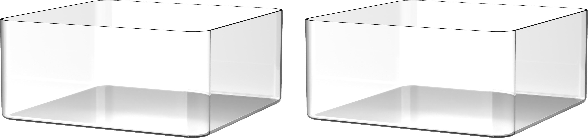

# 1. IoT Smart House Introduction

## 1.1 Product Introduction

The IoT Smart House is a comprehensive smart home IoT kit built on the micro:bit platform, which integrates a wide range of sensors and modules to enable automation, wireless control, and intelligent home management.

The IoT Smart House makes full use of all included components—such as light sensors, soil moisture sensors, temperature and humidity sensors, and a Wi-Fi communication module—allowing users to explore real-world applications of IoT technology. Through practical experience, you'll learn how to use these electronic modules to build an interconnected smart system, and how to bring your smart home ideas to life through coding.

## 1.2 Packing List

<table class="docutils-nobg" border="1" style="text-align:center;">
  <thead>
    <tr>
      <th style="text-align: center;">No.</th>
      <th style="text-align: center;">Product Name</th>
      <th style="text-align: center;">Quantity</th>
      <th style="text-align: center;">Picture</th>
    </tr>
  </thead>
  <tbody>
    <tr>
      <td>1</td>
      <td>Wooden board</td>
      <td>6</td>
      <td></td>
    </tr>
    <tr>
      <td>2</td>
      <td>Fan bracket</td>
      <td>1</td>
      <td></td>
    </tr>
    <tr>
      <td>3</td>
      <td>Short motor bracket</td>
      <td>1</td>
      <td></td>
    </tr>
    <tr>
      <td>4</td>
      <td>Long motor bracket</td>
      <td>1</td>
      <td></td>
    </tr>
    <tr>
      <td>5</td>
      <td>Fixed bracket for clothes airing rack</td>
      <td>1</td>
      <td></td>
    </tr>
    <tr>
      <td>6</td>
      <td>Clothes airing rack</td>
      <td>1</td>
      <td></td>
    </tr>
    <tr>
      <td>7</td>
      <td>Light sensor</td>
      <td>1</td>
      <td></td>
    </tr>
    <tr>
      <td>8</td>
      <td>WIFI module</td>
      <td>1</td>
      <td></td>
    </tr>
    <tr>
      <td>9</td>
      <td>I2C expansion module</td>
      <td>1</td>
      <td></td>
    </tr>
    <tr>
      <td>10</td>
      <td>ADC expansion module</td>
      <td>1</td>
      <td></td>
    </tr>
    <tr>
      <td>11</td>
      <td>Water pump module</td>
      <td>1</td>
      <td></td>
    </tr>
    <tr>
      <td>12</td>
      <td>Fan module</td>
      <td>1</td>
      <td></td>
    </tr>
    <tr>
      <td>13</td>
      <td>Glowy ultrasonic sensor</td>
      <td>1</td>
      <td></td>
    </tr>
    <tr>
      <td>14</td>
      <td>Raindrop module</td>
      <td>1</td>
      <td></td>
    </tr>
    <tr>
      <td>15</td>
      <td>RGB sensor</td>
      <td>1</td>
      <td></td>
    </tr>
    <tr>
      <td>16</td>
      <td>Soil module</td>
      <td>1</td>
      <td></td>
    </tr>
    <tr>
      <td>17</td>
      <td>Temperature and humidity sensor</td>
      <td>1</td>
      <td></td>
    </tr>
    <tr>
      <td>18</td>
      <td>LFD-01 servo</td>
      <td>2</td>
      <td></td>
    </tr>
    <tr>
      <td>19</td>
      <td>Plastic main servo horn</td>
      <td>2</td>
      <td></td>
    </tr>
    <tr>
      <td>20</td>
      <td>micro:bit board(optional)</td>
      <td>1</td>
      <td></td>
    </tr>
    <tr>
      <td>21</td>
      <td>micro:bit expansion board</td>
      <td>1</td>
      <td></td>
    </tr>
    <tr>
      <td>22</td>
      <td>Blister box</td>
      <td>2</td>
      <td></td>
    </tr>
    <tr>
      <td>23</td>
      <td>Battery case</td>
      <td>1</td>
      <td></td>
    </tr>
    <tr>
      <td>24</td>
      <td>18650 LiPo battery(1800mAh)</td>
      <td>2</td>
      <td></td>
    </tr>
    <tr>
      <td>25</td>
      <td>Charger</td>
      <td>1</td>
      <td></td>
    </tr>
    <tr>
      <td>26</td>
      <td>USB cable</td>
      <td>1</td>
      <td></td>
    </tr>
    <tr>
      <td>27</td>
      <td>4PIN sensor wires</td>
      <td>1</td>
      <td></td>
    </tr>
    <tr>
      <td>28</td>
      <td>Accessory bag</td>
      <td>1</td>
      <td></td>
    </tr>
  </tbody>
</table>

## 1.3 Notes

Please observe the following guidelines when using and storing Spiderbot:

- This product contains small parts and sharp pins, so it should be used under adult supervision and guidance.

- Small and pointed components may pose a choking or injury risk. Do not put them in your mouth or apply pressure.

- Spiderbot includes conductive components. Do not touch it with metal objects while powered on.

- Do not forcefully twist the servo after it is powered on, as this may cause damage to the servo.

- If the product will not be used for an extended period, fully charge the battery, remove it, and store it in a cool, dry place.

## 1.4 Copyright Notice

This manual is the intellectual property of Shenzhen Hiwonder Technology Co., Ltd. No part of this document may be copied, reproduced, translated, or distributed without prior written permission.

Any unauthorized use or infringement will be subject to legal action.

## 1.5 Disclaimer

The products described in this manual are provided on an "**as-is**" basis, including hardware, software, etc. While every effort has been made to ensure the accuracy of the content at the time of writing, we do not guarantee that the manual is completely free of errors or omissions. The material will be periodically reviewed, and we encourage users to provide feedback for improvements.

As the product is updated with new versions, its features and specifications may change. Please contact customer service at the time of purchase for the latest product information.

Furthermore, Hiwonder is not responsible for any malfunctions or damages caused by using the product in extreme conditions unless explicitly stated by Hiwonder as suitable for such use.
