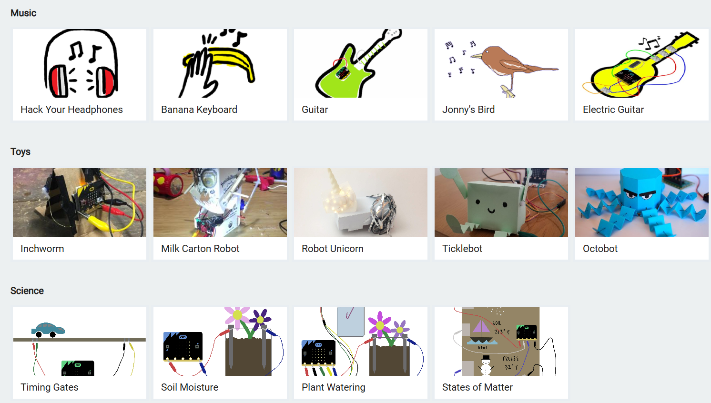
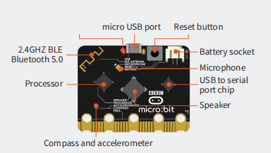
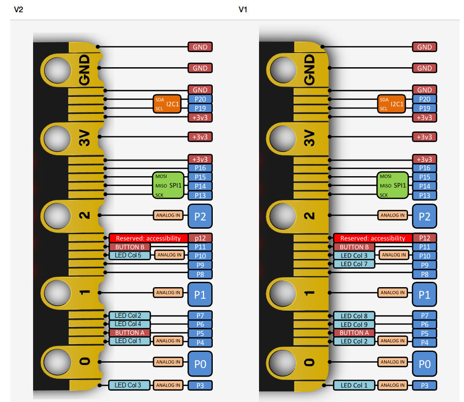
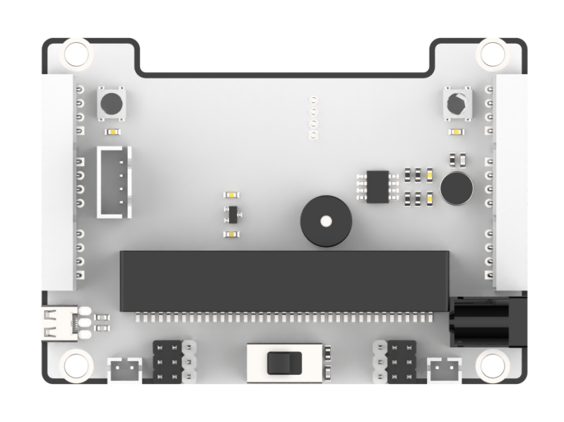
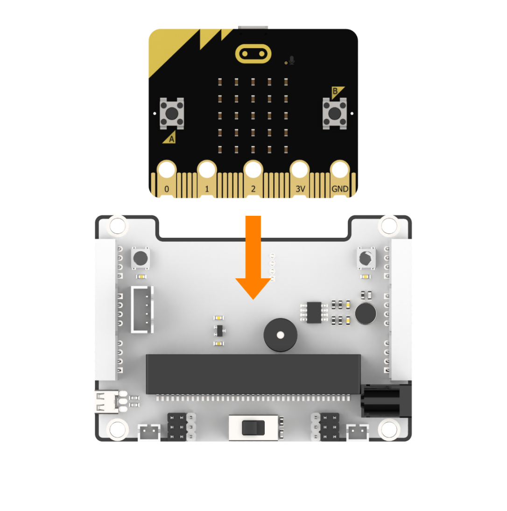
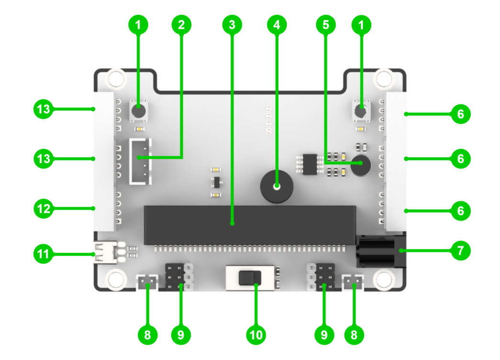
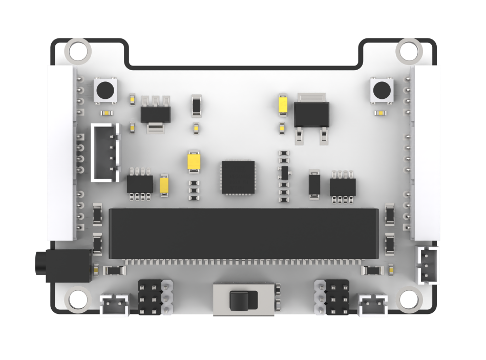
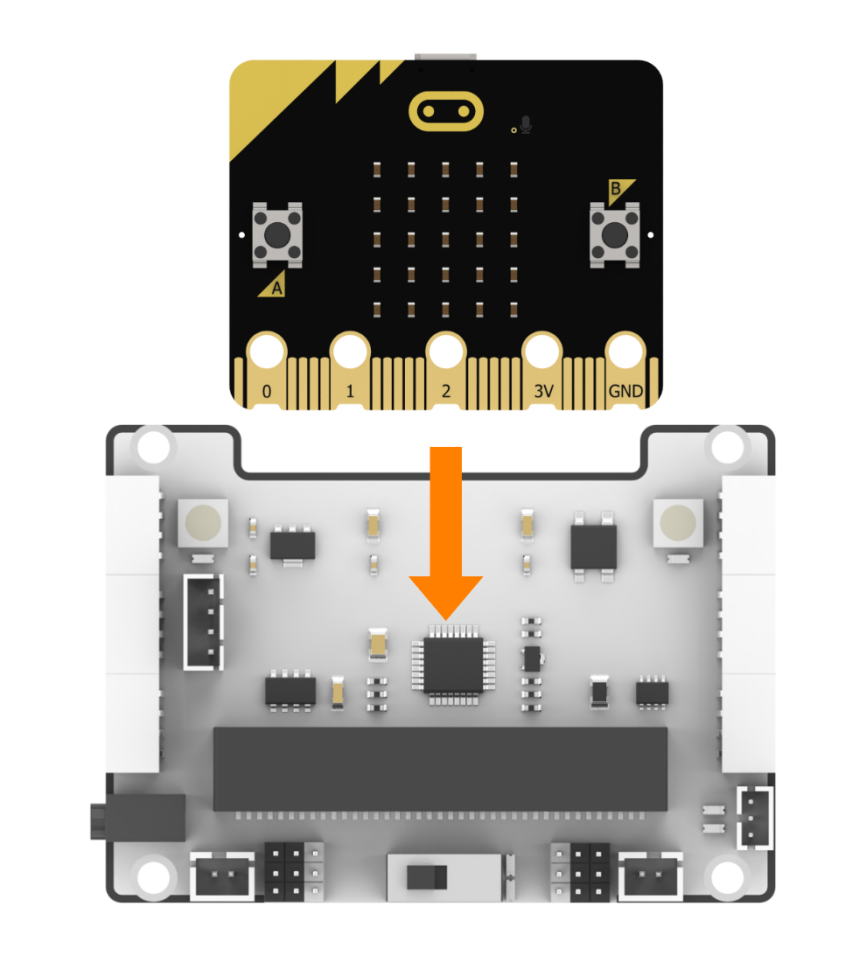
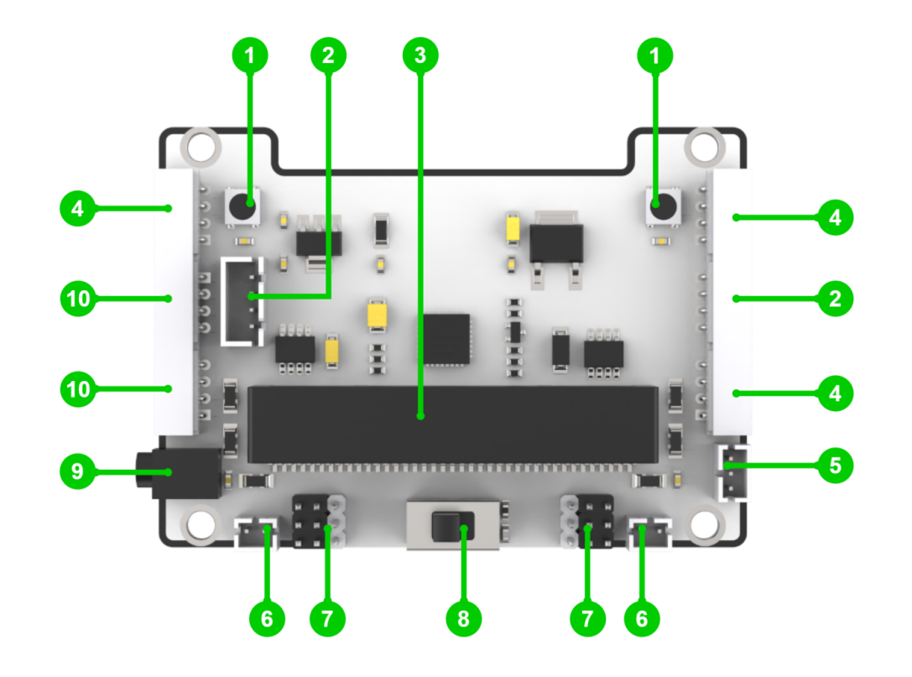

# 2. Introduction to the microbit Controller and Expansion Board

## 2.1 Introduction to the microbit Controller

### 2.1.1 Overview

The micro:bit is a microcomputer developed for youth programming education, initiated by the BBC and co-developed by Microsoft, Samsung, ARM, and others. It is only half the size of a credit card, yet it integrates a Bluetooth module, an accelerometer, a compass, three buttons, a 5×5 LED dot matrix, and a microphone.

The micro:bit offers many open-source libraries and fun solutions, which can be explored at: [https://makecode.microbit.org/](quot;https://makecode.microbit.org/&quot)

###  2.1.2 Functional Diagram

As shown in the diagram, the micro:bit consists mainly of an accelerometer, programmable buttons, pins, LED matrix, USB port, Bluetooth, radio, electronic compass (magnetometer), and other onboard modules.

### 2.1.3 Pin Output

### 2.1.4 Specifications

- Processor: Nordic nRF52833

- ARM: Cortex-M4 32-bit + FPU, 64 MHz

- RAM/Flash Memory: 128 KB RAM / 512 KB Flash

- Wireless: 2.4GHz Micro:bit Radio / BLE Bluetooth 5.0

- Power Supply: 5V via Micro USB port, 3V via edge connector or battery pack

- Operating Current: 300 mA

- Dimensions: 52 × 43.2 mm.

## 2.2 Introduction to the micro:bit Expansion Board

To make the micro:bit controller more convenient to use, we have developed a plug-and-play micro:bit expansion board. This expansion board integrates a wide range of functional modules, including RGB lights, six servo ports, DC motor drivers, and multiple expansion interfaces, meeting diverse development needs.

The expansion board is available in two power supply versions: a lithium battery version and a DC power version. Both versions offer essentially the same functions, with the main difference being the power source and their respective application scenarios. The lithium battery version is ideal for mobile robots such as intelligent wheeled robots, while the DC power version is better suited for fixed display setups, such as IoT Smart Houses and smart prosthetic hands. You can choose the version that best fits your specific needs.

### 2.2.1 Lithium Battery Version

* **Overview**

The lithium battery version of the expansion board is powered by a 18650 lithium battery. It integrates two RGB lights, a buzzer, a sound sensor, six servo control ports, two DC motor interfaces, and six expansion interfaces. This version is primarily used for products such as Qtruck and DaDabit.

The installation method for the micro:bit controller is shown in the diagram below:

* **Interface Description**

|       name | name |
| :------------------------: | :-------------------------------: |
|    1. RGB light module     | 2. Serial communication interface |
|    3. micro:bit socket     |             4. Buzzer             |
|      5. Sound sensor       |  6. IIC communication interface   |
|   7. DC power interface    |        8. Motor interface         |
|   9. PWM servo interface   |         10. Power switch          |
| 11. USB charging interface |         12. ADC interface         |
|      13. IO interface      |                                   |

* **Specifications**

(1) Supported controller: micro:bit controller.

(2) Power input: 3.7V (single battery) ~ 5V (USB power input).

(3) Charging method: DC interface charging.

(4) Dimensions: 83 × 60 mm.

### 2.2.2 DC Power Version

* **Overview**

The DC power version of the expansion board is powered by a 7.4V power supply. It integrates two RGB lights, two DC motor interfaces, and six expansion interfaces. This version is mainly used for products such as the IoT Smart House and AiHand.

The installation method for the micro:bit controller is shown in the diagram below:

* **Interface Description**

|       name       | name |
| :------------------------------: | :-------------------------------: |
|       1. RGB light module        | 2. Serial communication interface |
|       3. micro:bit socket        |         4. IIC interface          |
| 5. Power supply output interface |        6. Motor interface         |
|      7. PWM servo interface      |          8. Power switch          |
|      9. DC power interface       |         10. IO interface          |

* **Specifications**

(1) Supported controller: micro:bit mainboard.

(2) Power Input: 5V (via USB power input) ~ 8.4V (via DC power input).

(3) Dimensions: 83 × 60 mm.
