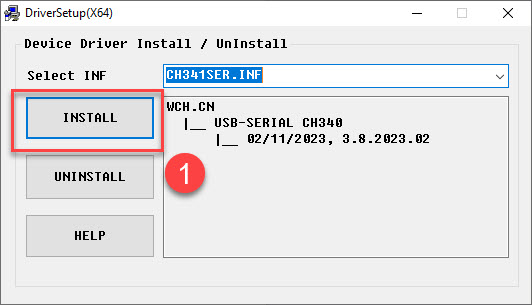
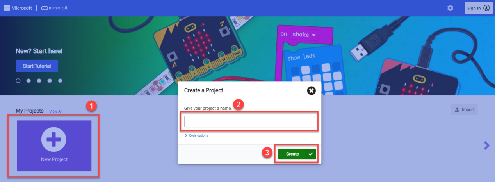
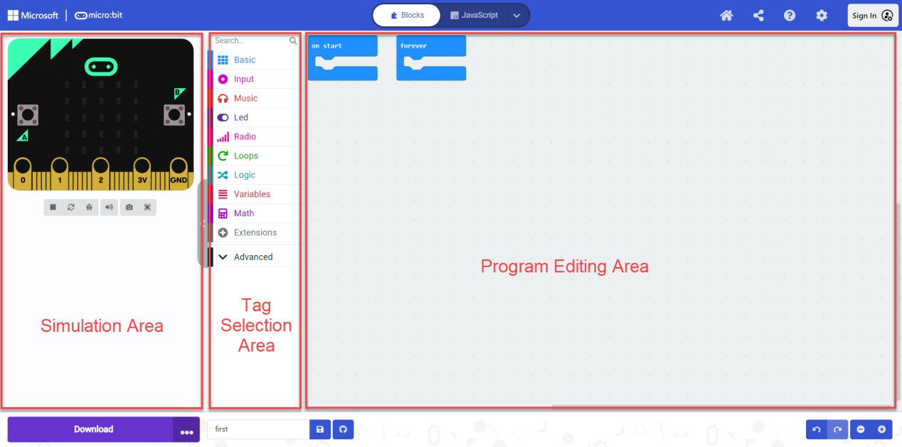
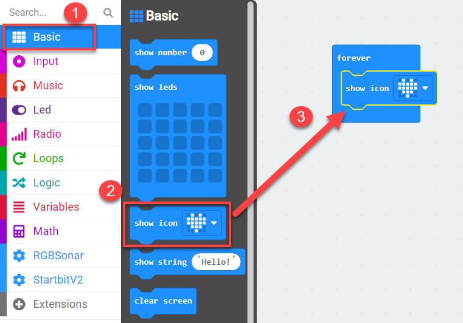
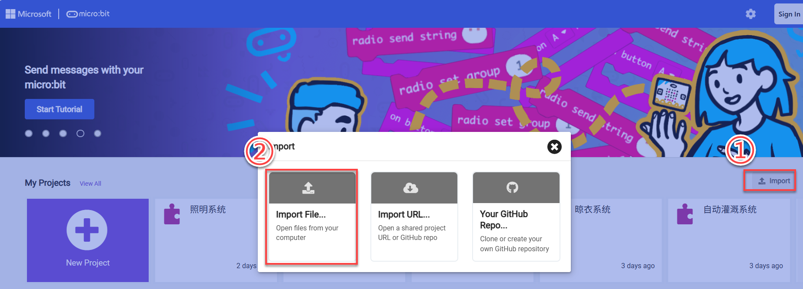
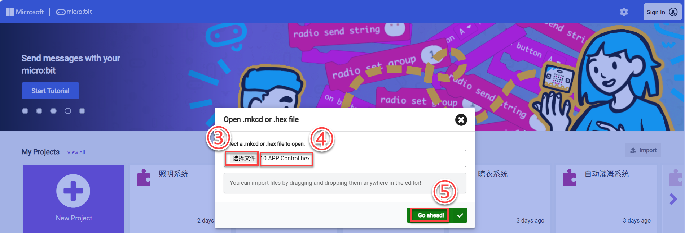
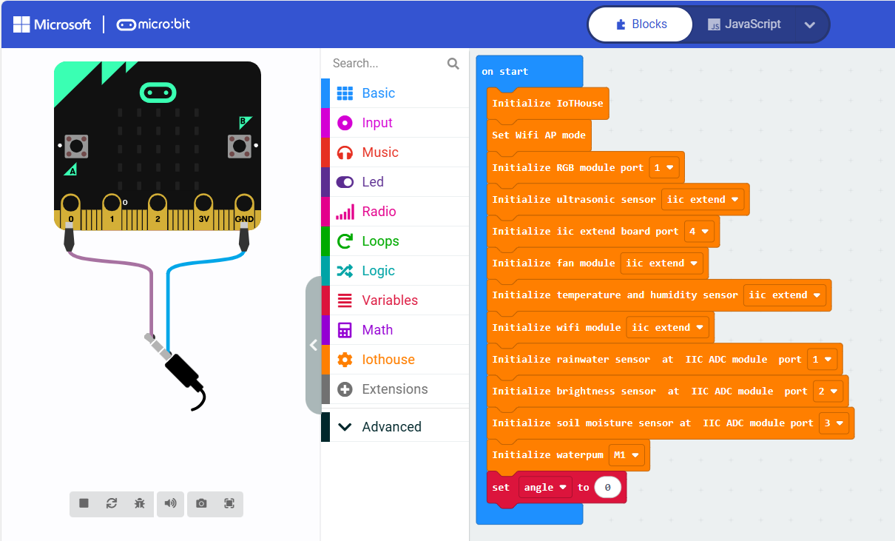
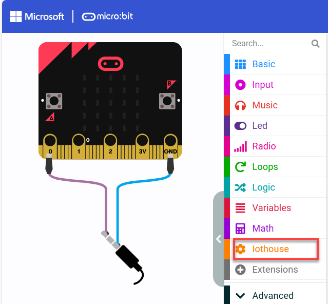
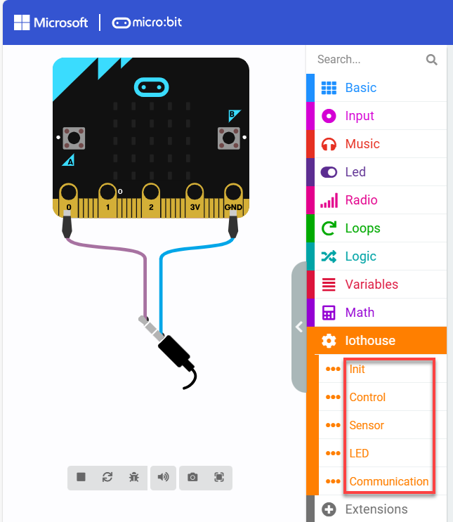

# 3. MakeCode Programming Software Tutorial

## 3.1 Introduction to IDE

Micro:bit is a product that does require installing an IDE. You can start programming directly through the website: [<u>https://makecode.microbit.org/</u>](https://makecode.microbit.org/)

## 3.2 Driver Installation

:::{Note}

Please ensure the CH341 serial driver is installed on your computer as it may effect the connection and usage of the Microbit controller in the following steps.

If it is already installed, you can skip this section.

:::

(1) Locate the "**ch341ser.exe**" serial port driver installer from the "**[Serial Driver Software](Appendix.md)**" folder, and open it.

(2) Click the "**Install**" button. Wait a moment for the installation success message to appear.

## 3.3 IDE Setup and Toolbar Layout

Open a browser tab and access the programming website by entering:

<https://makecode.microbit.org/>

To write your own code, click "**New Project**" to enter the project name.

After navigating to the main interface, the screen can be divided into the following two sections as outlined below:

| **Area** | **Function** |
|:--:|:--:|
| Simulation Area | Used for simulating programming instruction blocks |
| Tag Selection Area | You can use the built-in or add blocks from the extension packages for programming |
| Program Editing Area | You can insert, copy, paste, delete, modify in block editing area. |

## 3.4 Download Program 

(1) Let's start by creating a simple program. click on the **"Basic"** tab, then drag the "**show icon**"to the "**forever**"block.

(2) For initial device connection, it is necessary to pair the device first. Upon connection, the browser will remember the connected device. Click "**...**" next to "**Download**" button to select "**Connect Device**" from the options.

(3) In the pop-up window, click "**Next**" to continue.

(4) Click "**Pair**" and select the device for connection in the pop-up window.

(5) Once the device is successfully connected, click "**Download**" to download the program. During the download process, the yellow LED near the USB port of micro:bit will blink rapidly and continuously. At this point, please do not disconnect or move the cable to avoid download failure.

(6) When the download is complete, the indicator will stop flashing and remain steadily lit. Meanwhile, a download completion message will appear on the programming interface

(7) Micro:bit will automatically run the program once it's powered on.

## 3.5 Import Program

(1) Connect the micro:bit to your computer using a USB cable. Then open the online MakeCode programming page, click "**Import**" and select "**Import file**."

(2) Then click "**Choose File**," select the code file to be added, and click "**Continue**" to import the code into the online compiler.

## 3.6 Add Extension Package

(1) On the main interface, click on **"Extension"** in the left section.

(2) In the pop-up window, enter the extension package address: <https://github.com/Hiwonder/IoTHouse>

Then click on the search icon or press **"Enter"**. You can search for the package. Finally, click on **"**iothouse**"** to successfully add it.

Once added, the interface will automatically return to the programming screen. After loading is complete, you will see that the programming panel has successfully loaded the newly added extension package. Click on the **"**iothouse**"** tab to expand and view its contents.

