# 4. microbit Basic Course

## 4.1 Logo Control

### 4.1.1 Project Introduction

This project allows you to switch patterns by touching the logo on the micro:bit controller.

### 4.1.2 Project Process

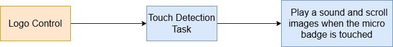

### 4.1.3 Module Instruction

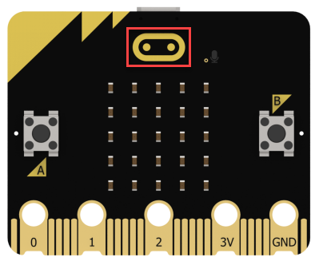

On version 2.0 of the micro:bit controller, the logo on the front is a capacitive touch sensor made of metal. It functions like a button—when touched, it sends a digital signal back to the micro:bit.

### 4.1.4 Program Download

[Source Code](../_static/source_code/microbit_basic_course.zip)

(1) Drag the program file from the corresponding folder into the MakeCode webpage.

(2) Connect the micro:bit controller to your computer using a USB data cable.

(3) Click the **"..."** next to the **Download** button and select **Connect Device** from the dropdown menu.

(4) In the pop-up window, click **Connect Device** again.

(5) Choose the device shown in the window as shown in the figure and click **Pair**.

(6) Once connected, click **Download** to transfer the program. During download, the yellow indicator light near the USB port on the back of the micro:bit will blink rapidly—do not disconnect or move the USB cable at this time to avoid failure.

(7) When the download is complete, the indicator light will stay solid, and a confirmation prompt will appear on the screen.

:::{Note}
The micro:bit drive should only contain the two files shown in the figure: `DETAILS.TXT` – contains micro:bit parameters, which can be ignored. `MICROBIT.HTM` – a link to the official micro:bit website, which requires internet access to open.
:::

### 4.1.5 Project Outcome

Once the program is downloaded, touching the logo will trigger the micro:bit to play a preset sound and scroll a heart pattern across the LED matrix.

### 4.1.6 Program Brief Analysis

[Source Code](../_static/source_code/microbit_basic_course.zip)

When the logo is touched, the micro:bit plays the **"Giggle"** sound, scrolls a heart image across the LED display, and then clears the screen.

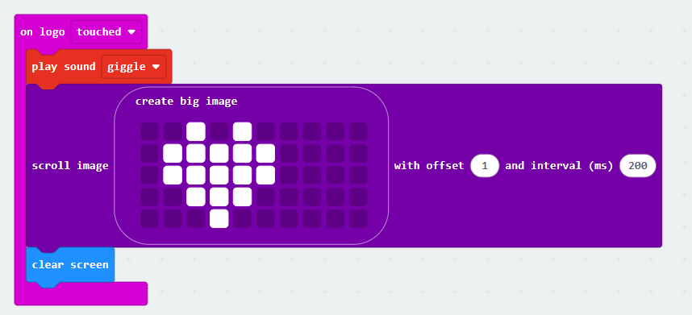

### 4.1.7 Feature Extensions

This section demonstrates how to change the image displayed during scrolling.

(1) Click on the pixels of the original heart image using your mouse to modify it into a smiling face.

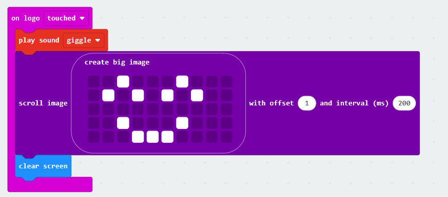

(2) Then, follow the steps in section 4. Program Download of this document to download the updated program to the micro:bit.

## 4.2 Smart Thermometer

### 4.2.1 Project Introduction

This project uses the micro:bit's main chip to implement a temperature detection function.

### 4.2.2 Project Process

### 4.2.3 Module Instruction

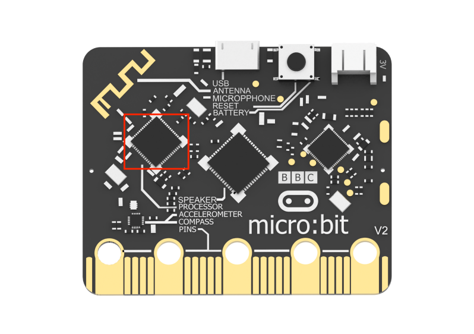

The micro:bit V2.0 uses the `nRF52833` chip, which enables the device to measure the current temperature in degrees Celsius.

### 4.2.4 Program Download

[Source Code](../_static/source_code/microbit_basic_course.zip)

(1) Drag the program file from the corresponding folder into the MakeCode webpage.

(2) Connect the micro:bit controller to your computer using a USB data cable.

(3) Click the **"..."** next to the **Download** button and select **Connect Device** from the dropdown menu.

(4) In the pop-up window, click **Connect Device** again.

(5) Choose the device shown in the window as shown in the figure and click **Pair**.

(6) Once connected, click **Download** to transfer the program. During download, the yellow indicator light near the USB port on the back of the micro:bit will blink rapidly—do not disconnect or move the USB cable at this time to avoid failure.

(7) When the download is complete, the indicator light will stay solid, and a confirmation prompt will appear on the screen.

:::{Note}
The micro:bit drive should only contain the two files shown in the figure above: `DETAILS.TXT` – contains micro:bit parameters, which can be ignored. `MICROBIT.HTM` – a link to the official micro:bit website, which requires internet access to open.
:::

### 4.2.5 Project Outcome

You can gently press the micro:bit's main chip with your finger. When the temperature exceeds 30°C, the buzzer will sound an alert.

### 4.2.6 Program Brief Analysis

[Source Code](../_static/source_code/microbit_basic_course.zip)

The program continuously displays the temperature data in a loop. If the temperature exceeds 30°C, it plays the sound **"Rising"**.

### 4.2.7 Feature Extensions

As an example of extending functionality, you can modify the temperature threshold required to trigger the sound.

(1) Change the condition from playing the sound when the temperature exceeds 30°C to playing it when it exceeds 25°C.

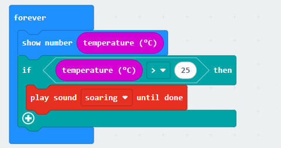

(2) Then, follow the steps in section 4. Program Download to download the updated program to the micro:bit.

## 4.3 Timer

### 4.3.1 Project Introduction

This project uses programming to turn the buttons on the micro:bit into a functional timer.

### 4.3.2 Project Process

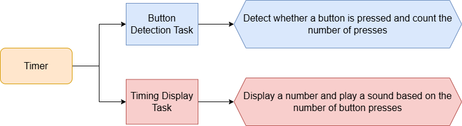

### 4.3.3 Module Instruction

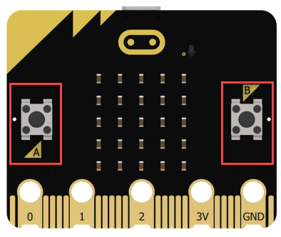

The front of the micro:bit board features two buttons labeled `A` and `B`. By writing code, you can trigger actions when these buttons are pressed and also measure how long they are held down.

### 4.3.4 Program Download

[Source Code](../_static/source_code/microbit_basic_course.zip)

(1) Drag the program file from the corresponding folder into the MakeCode webpage.

(2) Connect the micro:bit controller to your computer using a USB data cable.

(3) Click the **"..."** next to the **Download** button and select **Connect Device** from the dropdown menu.

(4) In the pop-up window, click **Connect Device** again.

(5) Choose the device shown in the window as shown in the figure and click **Pair**.

(6) Once connected, click **Download** to transfer the program. During download, the yellow indicator light near the USB port on the back of the micro:bit will blink rapidly—do not disconnect or move the USB cable at this time to avoid failure.

(7) When the download is complete, the indicator light will stay solid, and a confirmation prompt will appear on the screen.

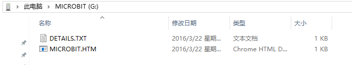

:::{Note}
The micro:bit drive should only contain the two files shown in the figure: `DETAILS.TXT` – contains micro:bit parameters, which can be ignored. `MICROBIT.HTM` – a link to the official micro:bit website, which requires internet access to open.
:::

### 4.3.5 Project Outcome

After uploading the program, for example, you can press button A five times, then press button B to confirm. After a 5-second delay, the buzzer will play a melody.

### 4.3.6 Program Brief Analysis

[Source Code](../_static/source_code/microbit_basic_course.zip)

(1) When powered on, the variables `count` and `flag` are initialized, and the number 0 is displayed.

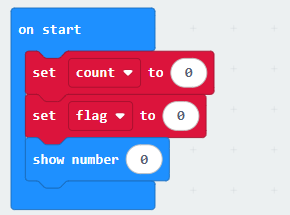

(2) Each time button `A` is pressed, `count` increases by 1 and its value is shown. When button `B` is pressed, `flag` is set to 1.

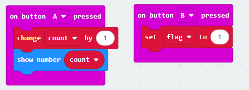

(3) The program then continuously checks if `flag` equals 1. If so, it waits for 1 second, decreases `count` by 1, and displays the updated value. Once `count` reaches 0, the buzzer plays the **"Yawn"** sound, and `flag` is reset to 0.

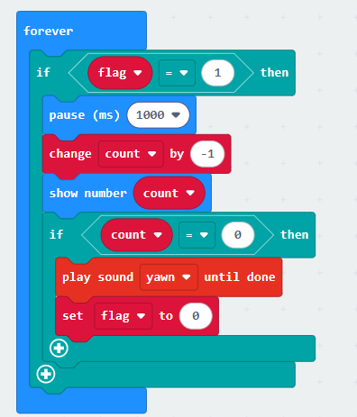

### 4.3.7 Feature Extensions

To modify the timer duration, for example,

(1) changing the countdown so that each press of button `A` represents 2 seconds instead of 1, you need to change the delay time from 1 second to 2 seconds in the program.

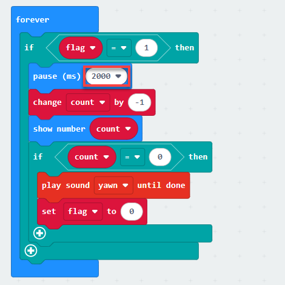

(2) Then, follow the steps in section 4. Program Download to download the updated program to the micro:bit.

## 4.4 Music Player

### 4.4.1 Project Introduction

This project uses programming to enable music playback through the micro:bit's buttons.

### 4.4.2 Project Process

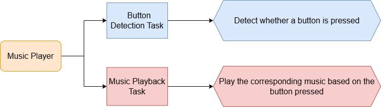

### 4.4.3 Module Instruction

The micro:bit V2.0 board includes a built-in speaker (buzzer), which can be programmed to produce sound.

### 4.4.4 Program Download

[Source Code](../_static/source_code/microbit_basic_course.zip)

(1) Drag the program file from the corresponding folder into the MakeCode webpage.

(2) Connect the micro:bit controller to your computer using a USB data cable.

(3) Click the **"..."** next to the **Download** button and select **Connect Device** from the dropdown menu.

(4) In the pop-up window, click **Connect Device** again.

(5) Choose the device shown in the window as shown in the figure and click **Pair**.

(6) Once connected, click **Download** to transfer the program. During download, the yellow indicator light near the USB port on the back of the micro:bit will blink rapidly—do not disconnect or move the USB cable at this time to avoid failure.

(7) When the download is complete, the indicator light will stay solid, and a confirmation prompt will appear on the screen.

:::{Note}
The micro:bit drive should only contain the two files shown in the figure: `DETAILS.TXT` – contains micro:bit parameters, which can be ignored. `MICROBIT.HTM` – a link to the official micro:bit website, which requires internet access to open.
:::

### 4.4.5 Project Outcome

After downloading the program, pressing Button `A` will play the melody of Two Tigers, while pressing Button `B` will play the melody of Twinkle Twinkle Little Star.

### 4.4.6 Program Brief Analysis

[Source Code](../_static/source_code/microbit_basic_course.zip)

(1) At startup, the variable `music_on` is initialized to 0.

(2) When Button `A` is pressed, `music_on` is set to 1, and the melody of Two Tigers is played. After playback, `music_on` is set back to 0.

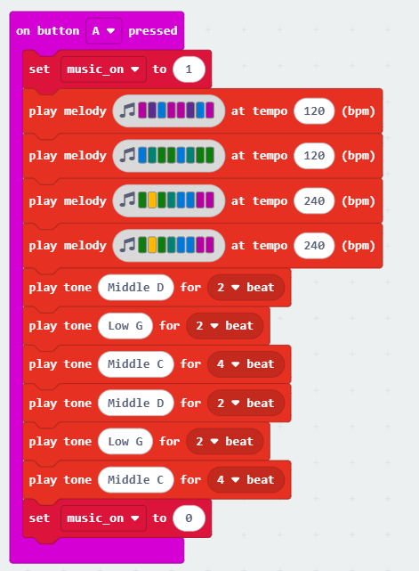

(3) When Button `B` is pressed, `music_on` is also set to 1, and the melody of Twinkle Twinkle Little Star is played. Once finished, `music_on` is reset to 0.

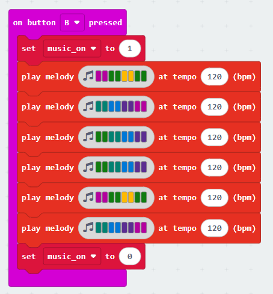

(4) The program continuously checks if `music_on` equals 1. If so, a musical note icon scrolls across the screen. Otherwise, the screen is cleared.

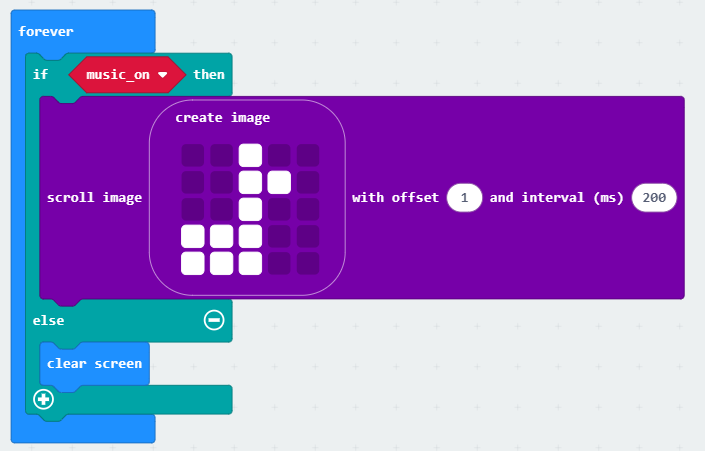

### 4.4.7 Feature Extensions

As an example of extending functionality, you can modify the music played when Button `A` is pressed. After playing Two Tigers, add a 0.5-second delay, then play a scale of Do, Re, Mi, Fa, Sol, La, Si, Do.

(1) To do this, locate the code block triggered by pressing Button `A`, add a 0.5-second delay block below it, followed by a music playback block.

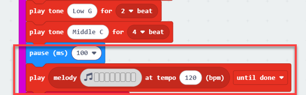

(2) Then, click on the melody block to open the melody editor.

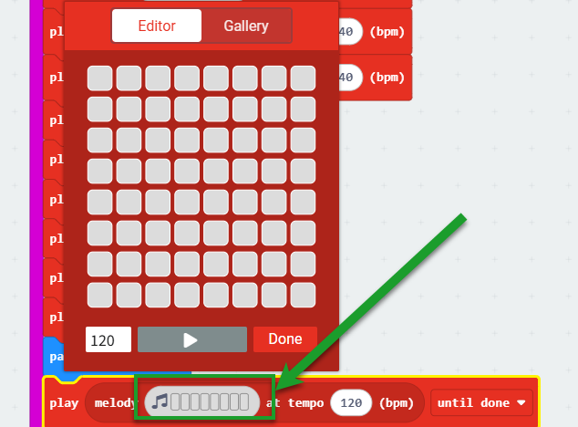

(3) Configure the scale by clicking the diagonal squares as shown in the diagram.

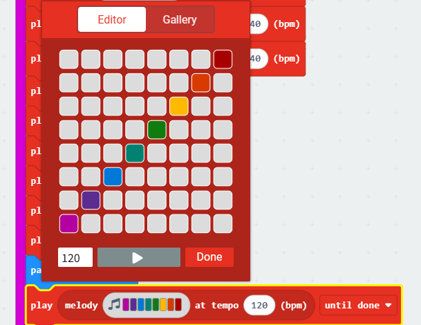

(4) Then, follow the steps in section 4. Program Download to download the updated program to the micro:bit.

## 4.5 Noise Detector

### 4.5.1 Project Introduction

This project uses programming to enable sound detection and response functionalities.

### 4.5.2 Project Process

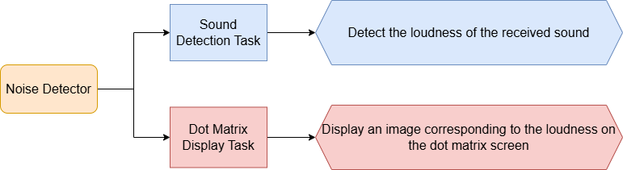

### 4.5.3 Module Instruction

The micro:bit V2.0 board includes a built-in microphone that provides sound input capabilities. When the microphone is active, a red LED light on the front of the board will turn on.

### 4.5.4 Program Download

[Source Code](../_static/source_code/microbit_basic_course.zip)

(1) Drag the program file from the corresponding folder into the MakeCode webpage.

(2) Connect the micro:bit controller to your computer using a USB data cable.

(3) Click the **"..."** next to the **Download** button and select **Connect Device** from the dropdown menu.

(4) In the pop-up window, click **Connect Device** again.

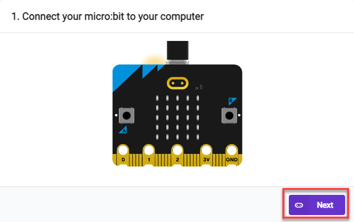

(5) Choose the device shown in the window as shown in the figure and click **Pair**.

(6) Once connected, click **Download** to transfer the program. During download, the yellow indicator light near the USB port on the back of the micro:bit will blink rapidly—do not disconnect or move the USB cable at this time to avoid failure.

(7) When the download is complete, the indicator light will stay solid, and a confirmation prompt will appear on the screen.

:::{Note}
The micro:bit drive should only contain the two files shown in the figure: `DETAILS.TXT` – contains micro:bit parameters, which can be ignored. `MICROBIT.HTM` – a link to the official micro:bit website, which requires internet access to open.
:::

### 4.5.5 Project Outcome

After the program is downloaded, you can speak toward the microphone on the micro:bit controller. The LED matrix will display bars of varying height to reflect the detected sound intensity.

### 4.5.6 Program Brief Analysis

[Source Code](../_static/source_code/microbit_basic_course.zip)

(1) At startup, the serial port is redirected to USB for printing output via USB. The `sound` variable is then initialized to 0.

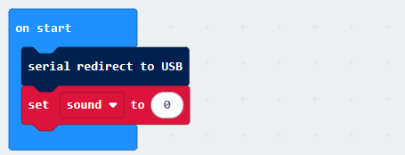

(2) In the loop, the loudness of the sound is printed to the serial monitor, and the `sound` variable is updated with a mapped value ranging from 0 to 5. Based on the value of `sound`, a corresponding image is displayed. Otherwise, the string **"Warning!"** is shown.

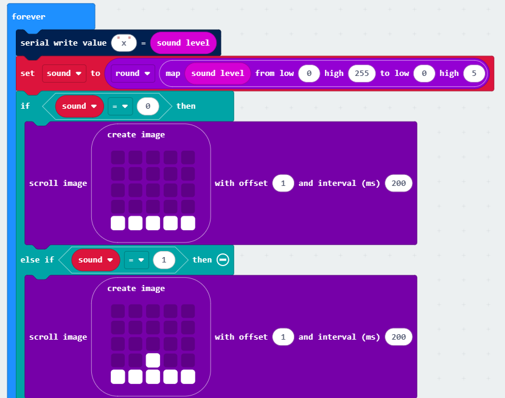

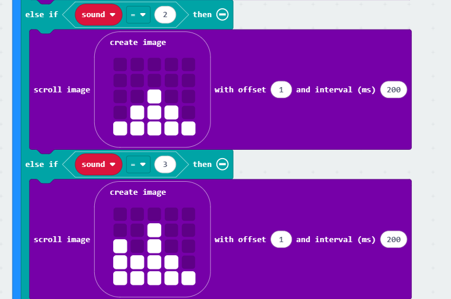

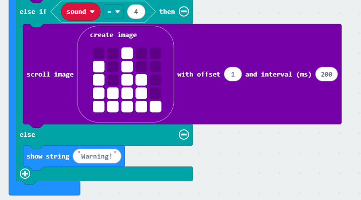

### 4.5.7 Feature Extensions

As an example of feature extension, you can modify the image scrolling speed.

(1) Change the offset interval from 200 ms to 500 ms to slow down the image scrolling effect.

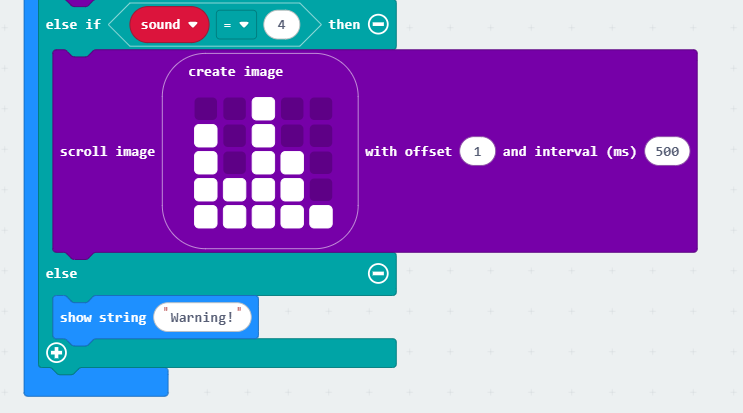

(2) Then, follow the steps in section 4. Program Download to download the updated program to the micro:bit.

## 4.6 Night Alarm

### 4.6.1 Project Introduction

This project uses programming to enable light detection and trigger a response based on light intensity.

### 4.6.2 Project Process

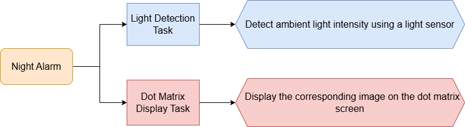

### 4.6.3 Module Instruction

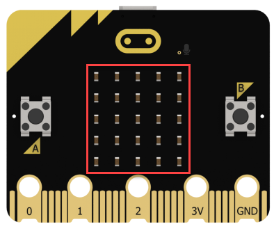

The micro:bit controller can enter input mode by reversing the LED display. The LED matrix also functions as a basic light sensor, allowing it to detect ambient light levels.

### 4.6.4 Program Download

[Source Code](../_static/source_code/microbit_basic_course.zip)

(1) Drag the program file from the corresponding folder into the MakeCode webpage.

(2) Connect the micro:bit controller to your computer using a USB data cable.

(3) Click the **"..."** next to the **Download** button and select **Connect Device** from the dropdown menu.

(4) In the pop-up window, click **Connect Device** again.

(5) Choose the device shown in the window as shown in the figure and click **Pair**.

(6) Once connected, click **Download** to transfer the program. During download, the yellow indicator light near the USB port on the back of the micro:bit will blink rapidly—do not disconnect or move the USB cable at this time to avoid failure.

(7) When the download is complete, the indicator light will stay solid, and a confirmation prompt will appear on the screen.

:::{Note}
The micro:bit drive should only contain the two files shown in the figure: `DETAILS.TXT` – contains micro:bit parameters, which can be ignored. `MICROBIT.HTM` – a link to the official micro:bit website, which requires internet access to open.
:::

### 4.6.5 Project Outcome

Once the program is successfully downloaded, move the micro:bit controller into a dark environment. The LED matrix will display a **"C"** icon, and the speaker will emit a sound alert.

### 4.6.6 Program Brief Analysis

[Source Code](../_static/source_code/microbit_basic_course.zip)

(1) At startup, the serial port is redirected to USB for output.

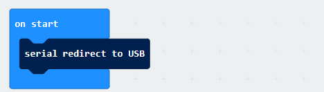

(2) In the main loop, the program prints the brightness level via the USB serial connection. If the brightness level is less than 5, the LED matrix shows a moon icon, and the buzzer emits a beep. If the brightness level is greater than 5, the LED matrix displays a sun icon.

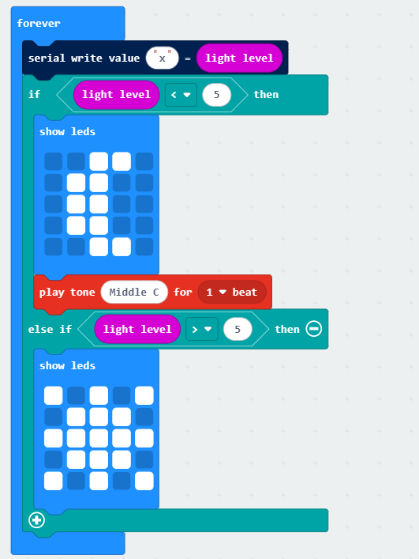

### 4.6.7 Feature Extensions

This example demonstrates how to adjust the brightness threshold.

(1) Originally, brightness below 5 was considered night. Now, update the condition so that brightness below 3 is treated as night, and anything above that is considered daytime.

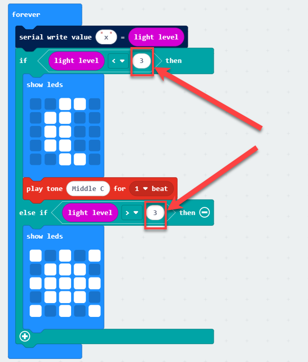

(2) Then, follow the steps in section 4. Program Download to download the updated program to the micro:bit.

## 4.7 Compass

### 4.7.1 Project Introduction

This project demonstrates how to detect direction and display an arrow using programming.

### 4.7.2 Project Process

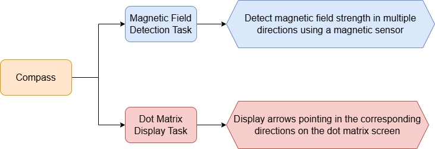

### 4.7.3 Module Instruction

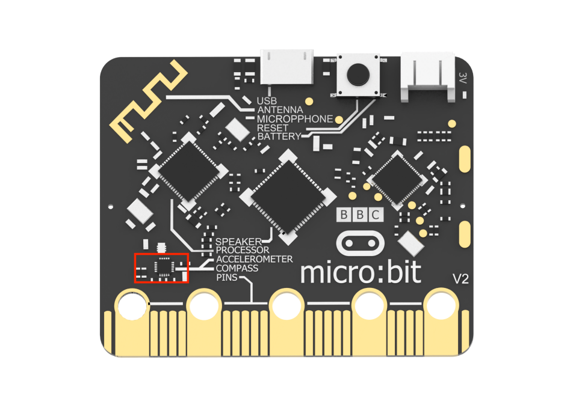

The micro:bit controller features a `magnetometer`, which acts as an electronic compass. It can measure the magnetic field strength from multiple directions. With programming, this sensor enables magnetic field detection and direction tracking.

### 4.7.4 Program Download

[Source Code](../_static/source_code/microbit_basic_course.zip)

(1) Drag the program file from the corresponding folder into the MakeCode webpage.

(2) Connect the micro:bit controller to your computer using a USB data cable.

(3) Click the **"..."** next to the **Download** button and select **Connect Device** from the dropdown menu.

(4) In the pop-up window, click **Connect Device** again.

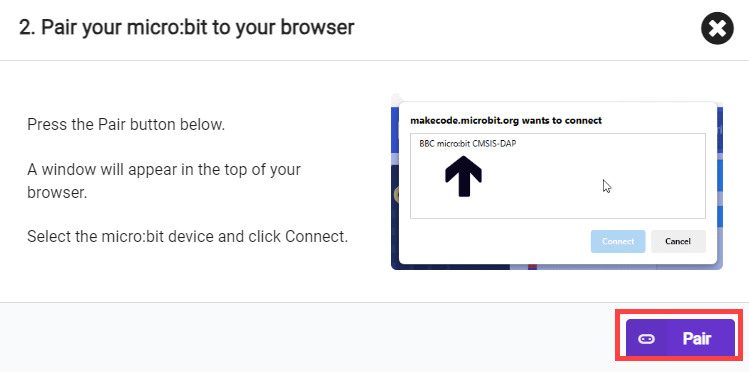

(5) Choose the device shown in the window as shown in the figure and click **Pair**.

(6) Once connected, click **Download** to transfer the program. During download, the yellow indicator light near the USB port on the back of the micro:bit will blink rapidly—do not disconnect or move the USB cable at this time to avoid failure.

(7) When the download is complete, the indicator light will stay solid, and a confirmation prompt will appear on the screen.

:::{Note}
The micro:bit drive should only contain the two files shown in the figure: `DETAILS.TXT` – contains micro:bit parameters, which can be ignored. `MICROBIT.HTM` – a link to the official micro:bit website, which requires internet access to open.
:::

### 4.7.5 Project Outcome

:::{Note}
After downloading the program, the micro:bit will scroll the message **"TILT TO FILL SCREEN".** This indicates the need to calibrate the compass. Hold the micro:bit and tilt it in all directions—forward, backward, left, and right—until all the LEDs on the display light up.
:::

Once calibration is complete, tilt the board in different directions again, and the LED matrix will display arrows pointing in the corresponding compass direction.

### 4.7.6 Program Brief Analysis

[Source Code](../_static/source_code/microbit_basic_course.zip)

(1) At startup, the serial port is redirected to USB for output.

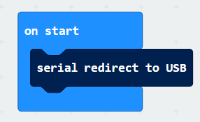

(2) In the loop, it continuously prints the compass heading angle via the serial port. If the compass angle is less than 22.5° or greater than 337.5°, an arrow pointing north is displayed. If the angle is between 22.5° and 67.5°, a northwest arrow is shown. The same logic continues for other directions, displaying the corresponding directional arrows on the LED matrix.

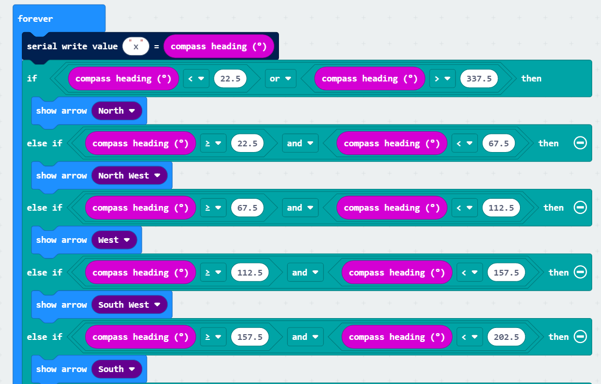

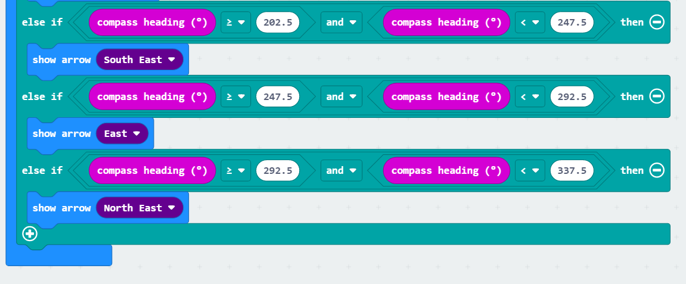

### 4.7.7 Feature Extensions

This example shows how to enhance the program by printing the name of the direction to the serial port when the compass points to it.

(1) For example, when the heading is determined to be north, add a serial write command in that conditional block to print **"North".**

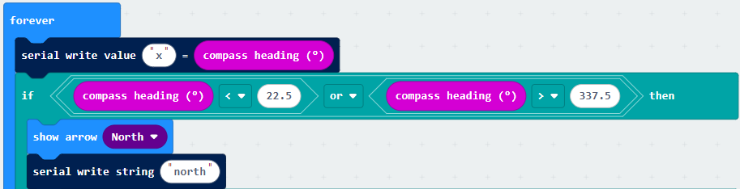

(2) Then, follow the steps in section 4. Program Download to download the updated program to the micro:bit.