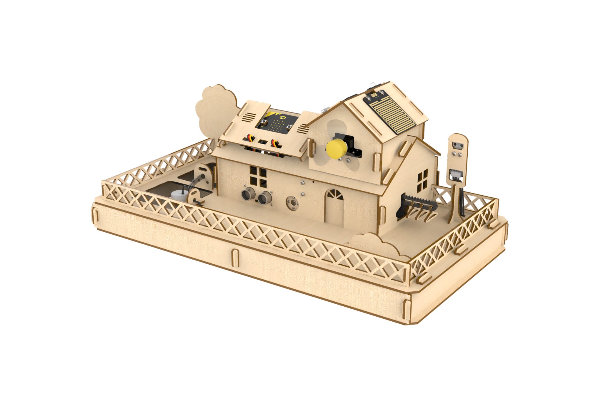
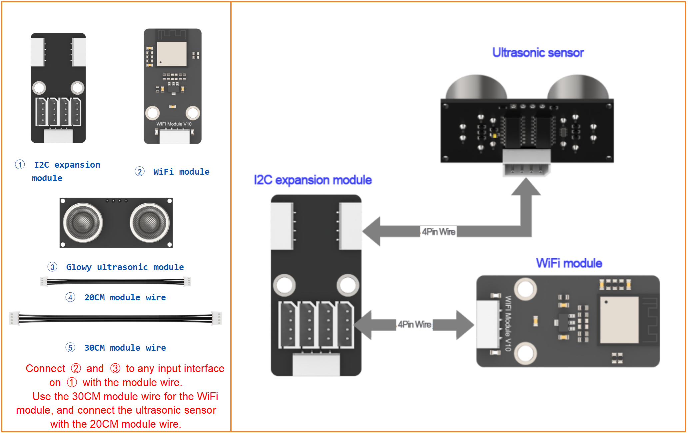
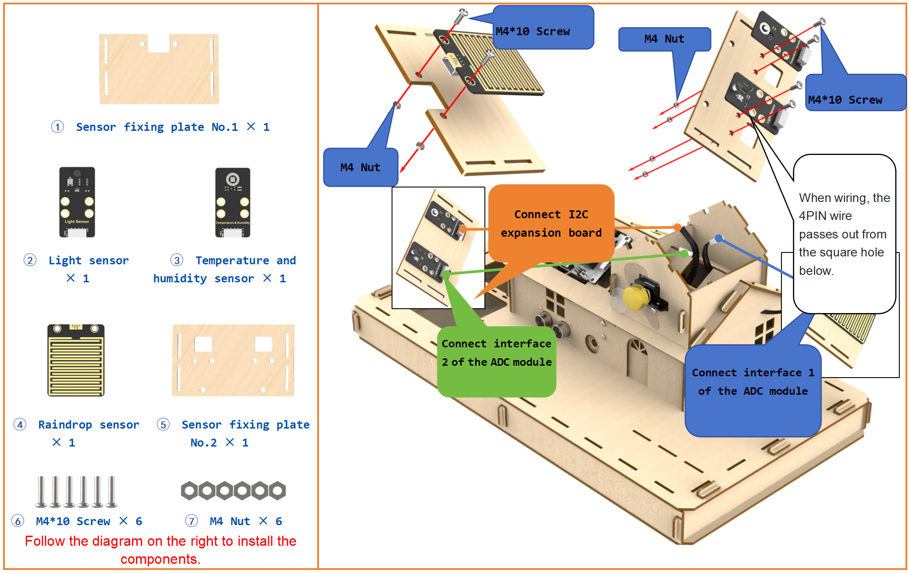
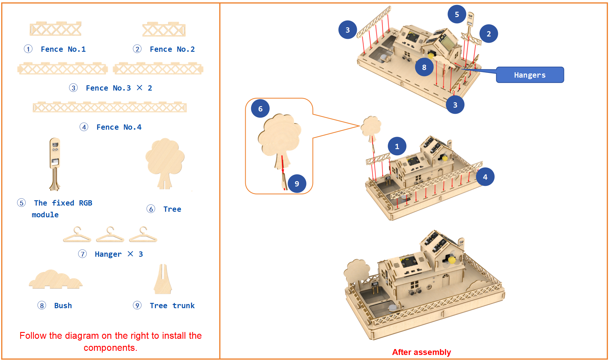

# 5. Assembly

## 5.1 Servo Initial Position Adjustment Instruction

:::Note}
Before installing the servo horn, you must first download the servo initial position program, power on the servo, and set the servo to return to its initial position. Then, install the servo horn. Failure to follow the steps above may affect the performance of functions such as door control and clothes-drying rack operations.
:::

### 5.1.1 Program Download

[Source Code](../_static/source_code/servo_lnitial_position_adjustment_program.zip)

(1) Connect the **micro:bit** controller to your computer using a USB data cable. A **"MICROBIT"** disk will appear on your computer.

(2) Drag and drop the **"Servo Initial Position Adjustment Program"** into the **micro:bit** disk, which is located in the same directory as this document.

### 5.1.2 Servo Wiring

Connect the door control servo to port 1 and the clothes-drying rack servo to port 4. Then, connect the battery box. Make sure the servo wiring exactly matches the diagram below.

### 5.1.3 Power On

Switch the battery box and the expansion board to the **"ON"** position.

## 5.2 Assembly Instruction

Assembly Instruction

Step1:Build up base(1)

Step2:Build up base(2)

Step3:Install servo bracket

Step4:Install Servo

Step5:Install Servo Horn

Step6:Reserve module wire in the base

Step7:Install Base(3)

Step8:Install door and ultrasonic sensor

Step9:Install WiFi module

Step10:Fix the house on the base(1)

Step11:Wire ultrasonic sensor and WiFi module

Step12:Fix the house on the base(2)

Step13:Lead out wires of I2C & ADC expansion modules

Step14:Install micro:bit expansion board

Step15:Connect servo and I2C expansion module to micro:bit expansion board

Step16:Connect ADC module to micro:bit expansion board    

Step17:Diagram of the completed wiring

Step18:Fix the house on the base(3)

Step19:Install the roof

Step20:Install the roof

Step21:Wire fan module

Step22:Install fan module on the roof

Step23:Install raindrop, temperature and humidity, and light sensors

Step24:Install raindrop, temperature and humidity, and light sensors

Step25:Install micro:bit cover

Step26:Install soil humidity sensor and water pump

Step27:Wire soil humidity senor

Step28:Wire soil humidity senor

Step29:Install and wire RGB module

Step30:Install fence

Step31:Install suction pipe

Step32:Overall wiring diagram

Step33:Final Effect Diagram

