# 6. Smart Home Projects

## 6.1 Lighting System

### 6.1.1 Project Introduction

This project builds a light-controlled lighting system using a light sensor and an RGB LED module. It controls the RGB light based on ambient light intensity.

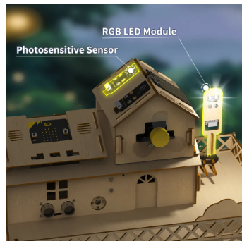

When the light sensor detects that the ambient light is below a certain threshold, the RGB light turns on. When the ambient light is above the threshold, the RGB light turns off.

### 6.1.2 Project Process

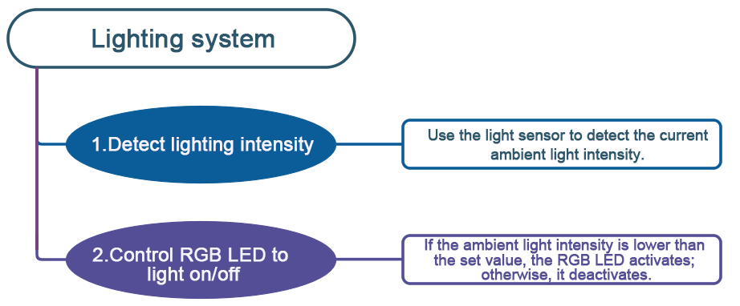

### 6.1.3 Module Instruction

*   **RGB Light Module**

The RGB LED module is an output device that allows control of color, brightness, and blinking.

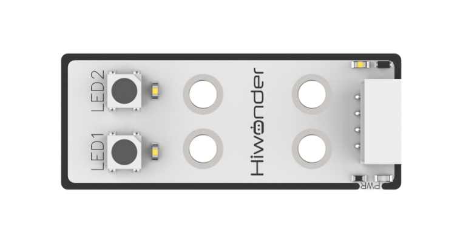

It features two adjustable full-spectrum RGB LED beads. By combining red (R), green (G), and blue (B), a wide range of colors can be produced.

*   **Light Sensor**

The light sensor is used to detect the intensity of ambient light. It converts light signals into electrical signals and is commonly used in interactive projects that react to changes in light intensity—such as automatic street lighting systems and environmental monitoring systems.

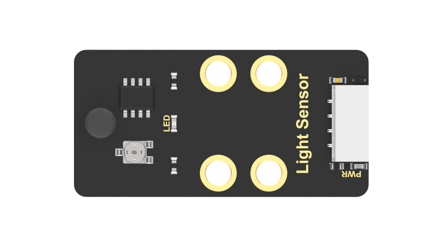

When light shines on the photoresistor, the stronger the light, the lower the resistance. As a result, the voltage across the resistor increases, causing the LED on the sensor to light up. Conversely, when the light is weak, the resistance increases, the voltage drops, and the LED turns off.

### 6.1.4 Program Download
[Source Code]()

(1) Drag the program file from the corresponding folder into the MakeCode webpage.

(2) Click icon  on the left bottom of the interface, then click **"Connect Device"**, and follow the on-screen instructions to connect the micro:bit controller.

(3) Once connected, click the **"Download"** button in the bottom-left corner to flash the program to your micro:bit.

(4) After the download is complete, the indicator light will stop flashing rapidly and remain steadily lit. At the same time, a download completion message will appear on the programming interface.

### 6.1.5 Project Outcome

In this program, light intensity is converted to a digital value ranging from 0 to 255. When the ambient light intensity is greater than or equal to 50, the LED turns off. When the light intensity is less than 50, the LED turns on.

### 6.1.6 Program Brief Analysis
[Source Code]()

(1) The program begins by initializing the `IoTHouse` module and the serial port, and sets the brightness of the RGB light.

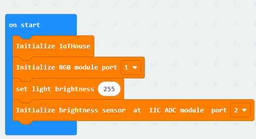

(2) It then checks whether the value from the light sensor is less than 50.

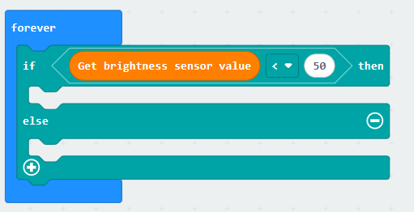

(3) If it is less than 50, it means the current light intensity is relatively low, so the RGB light is turned on.

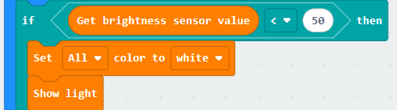

(4) Otherwise, the RGB light is turned off.

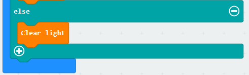

The complete code is as follows:

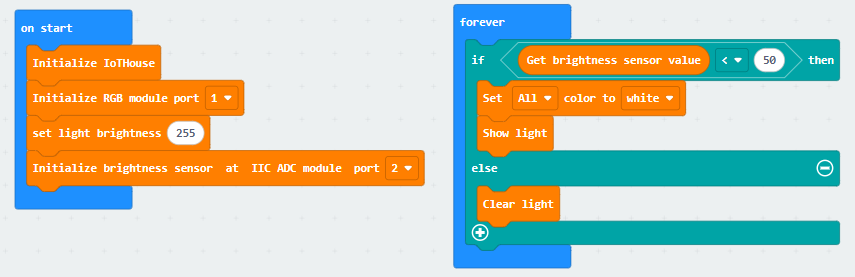

## 6.2 Light Control System

### 6.2.1 Project Introduction

This project builds a light control system using RGB lights, which controls the RGB light colors based on the number of times the logo button on the micro:bit is pressed.

### 6.2.2 Project Process

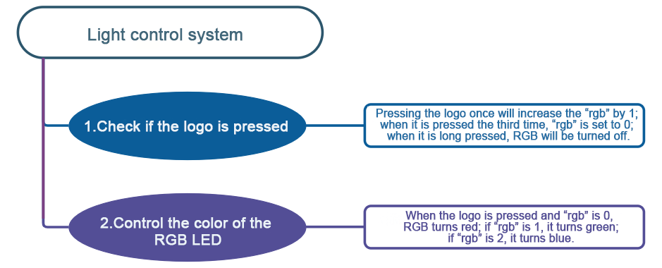

### 6.2.3 Module Instruction

The RGB LED module is an output device that allows control of color, brightness, and blinking.

It features two adjustable full-spectrum RGB LED beads. By combining red (R), green (G), and blue (B), a wide range of colors can be produced.

**For a detailed introduction to this sensor, please refer to the folder: [3.Specification & Diagram->2.Sensor Parameters]().**

### 6.2.4 Program Download
[Source Code]()

(1) Drag the program file from the corresponding folder into the MakeCode webpage.

(2) Click icon  on the left bottom of the interface, then click **"Connect Device"**, and follow the on-screen instructions to connect the micro:bit controller.

(3) Once connected, click the **"Download"** button in the bottom-left corner to flash the program to your micro:bit.

(4) After the download is complete, the indicator light will stop flashing rapidly and remain steadily lit. At the same time, a download completion message will appear on the programming interface.

### 6.2.5 Project Outcome

Pressing the logo on the micro:bit allows you to toggle the RGB light between red, green, and blue. Long-pressing the logo turns off the RGB light.

### 6.2.6 Program Brief Analysis
[Source Code]()

(1) The program begins by initializing the `IoTHouse` and the serial port, and sets the brightness of the RGB light.

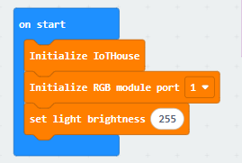

(2) A new variable named `rgb` is created to serve as a flag that controls which color the RGB light should display when the logo is pressed.

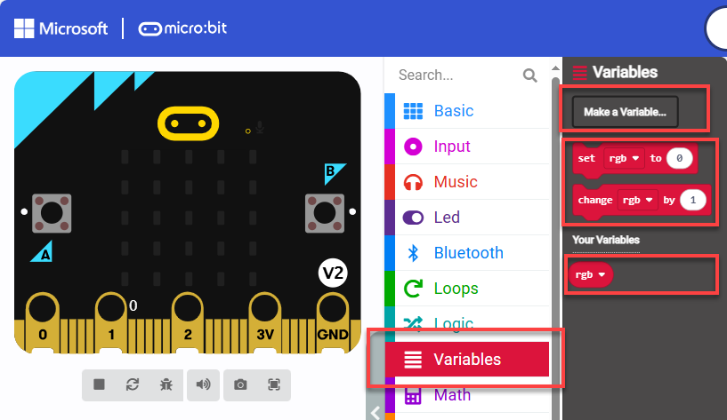

(3) Initially, the `rgb` variable is set to 0.

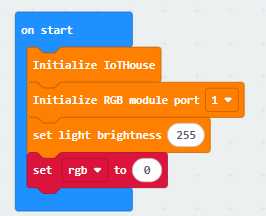

(4) The program checks whether the logo button is pressed.

(5) When the logo button is pressed, the program then checks whether the value of the variable `rgb` is 0.

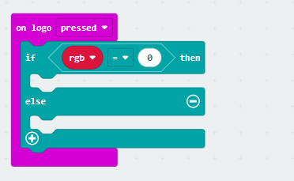

(6) If `rgb` is 0, the RGB light turns red, the letter **"R"** is displayed on the micro:bit LED matrix, and `rgb` is incremented to 1.

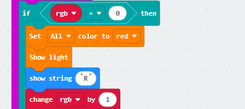

(7) Otherwise, the program checks whether the value of the variable `rgb` is 1.

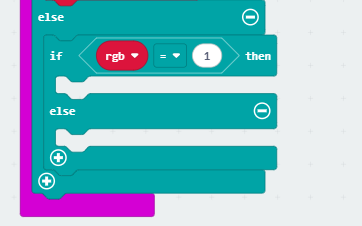

(8) If `rgb` is 1, the RGB light turns green, **"G"** is displayed, and `rgb` is incremented to 2.

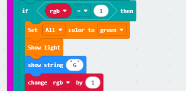

(9) Otherwise, the program checks whether the value of the variable `rgb` is 2.

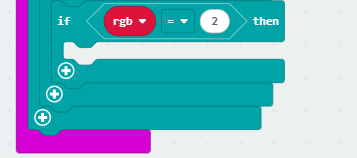

(10) If `rgb` is 2, the RGB light turns blue, **"B"** is displayed, and `rgb` is reset to 0.

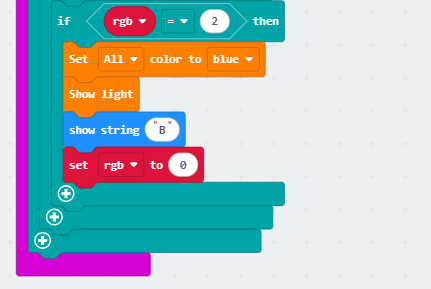

(11) When the logo is long-pressed, the RGB light turns off and the LED matrix is cleared.

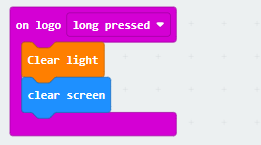

## 6.3 Clothes-drying System

:::{Note}
Spraying water on sensors (except the raindrop sensor) may cause short circuits or malfunction. If the battery gets wet, it may even explode. Please be extremely careful! For younger users, please operate together with your parents. To ensure safety, please follow the instructions and safety regulations!
:::

### 6.3.1 Project Introduction

This project uses a raindrop sensor, a light sensor, and a servo to create a clothes-drying system that controls drying based on weather and day/night conditions.

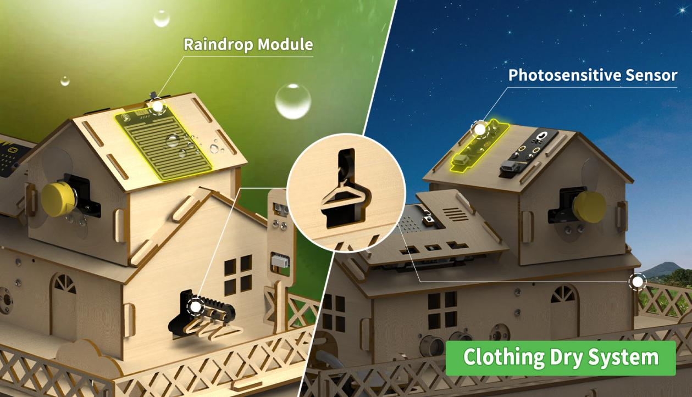

When rain or darkness is detected, the drying rack automatically retracts the clothes indoors. When there is no rain and it is daylight, the drying rack automatically extends the clothes outdoors. This system can not only monitor rainfall but also detect outdoor light conditions.

### 6.3.2 Project Process

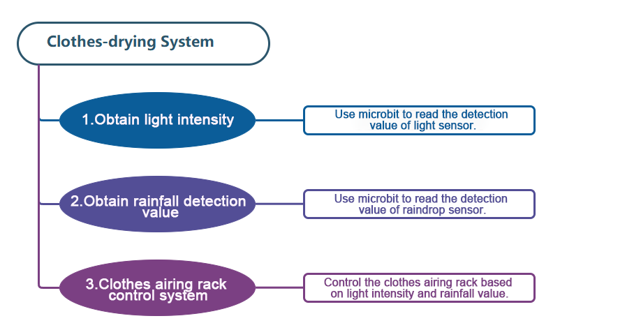

### 6.3.3 Module Instruction

*   **Light Sensor**

The light sensor is used to detect the intensity of ambient light. It converts light signals into electrical signals and is commonly used in interactive projects that react to changes in light intensity—such as automatic street lighting systems and environmental monitoring systems.

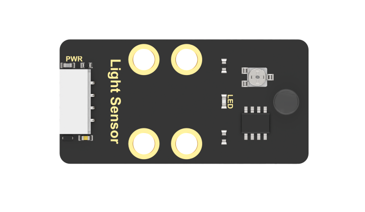

When light shines on the photoresistor, the stronger the light, the lower the resistance. As a result, the voltage across the resistor increases, causing the LED on the sensor to light up. Conversely, when the light is weak, the resistance increases, the voltage drops, and the LED turns off.

*   **LFD-01 Servo**

LFD-01 is a PWM digital servo. To operate it, send a PWM signal with a 20ms cycle to the signal terminal, then adjust the pulse width to control the servo angle. The adjustable pulse width is from 500 to 2500μs, which corresponds to the angle of 0° to 180°.

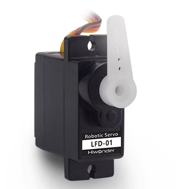

### 6.3.4 Program Download
[Source Code]()

(1) Drag the program file from the corresponding folder into the MakeCode webpage.

(2) Click icon  on the left bottom of the interface, then click **"Connect Device"**, and follow the on-screen instructions to connect the micro:bit controller.

(3) Once connected, click the **"Download"** button in the bottom-left corner to flash the program to your micro:bit.

(4) After the download is complete, the indicator light will stop flashing rapidly and remain steadily lit. At the same time, a download completion message will appear on the programming interface.

### 6.3.5 Project Outcome

When the ambient light intensity is ≥ 50 and the raindrop sensor value is ≤ 30, the clothes drying rack will extend. When the light intensity is < 50 or the raindrop sensor value is > 30, the drying rack will retract.

### 6.3.6 Program Brief Analysis
[Source Code]()

(1) At startup, initialize the light sensor and raindrop sensor.

(2) Under the **"Variables"** tab, click **"Make a Variable"** to create a variable named `angle`, which will be used to control the servo motor and drive the drying rack.

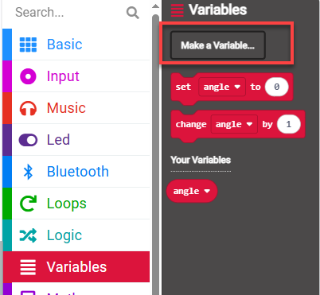

(3) Set the `angle` variable to 180, then configure servo 4 to rotate to the angle (180°), with a duration of 300 ms.

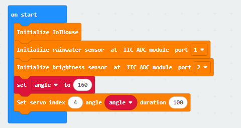

(4) Go to the **"Advanced"** tab, choose **"Functions"** and create two functions named `open` and `close`.

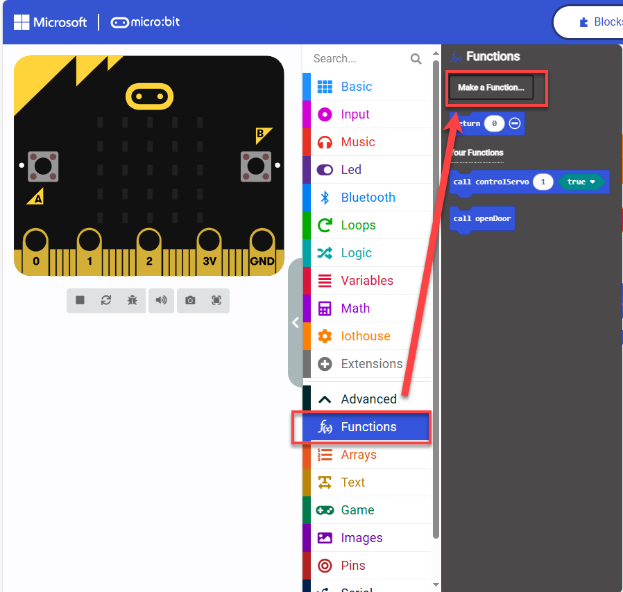

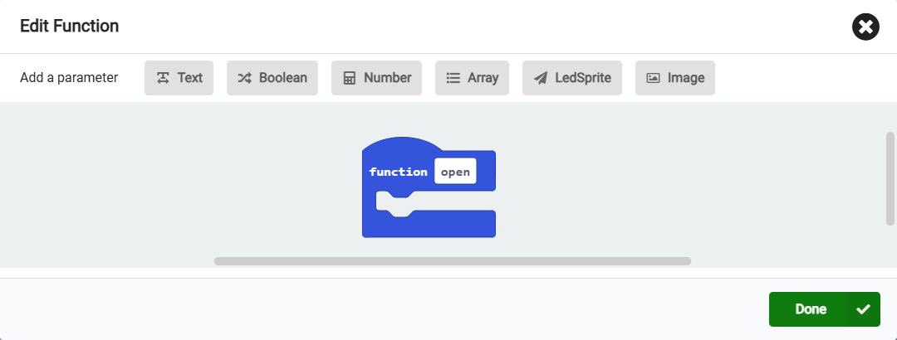

(5) Within the infinite loop, set two conditional statements: if the raindrop sensor value is greater than 30 or the light sensor value is less than 50, use an `OR` logic block to combine them.

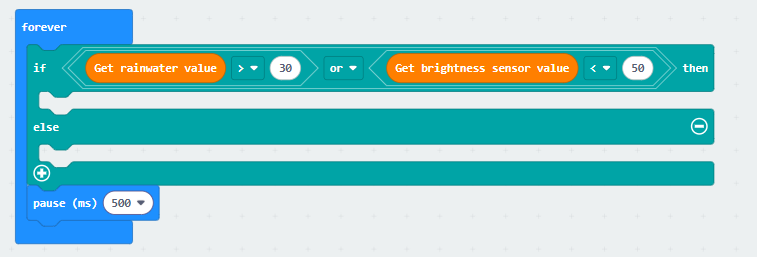

(6) Drag the `open` and `close` functions into the appropriate condition blocks.

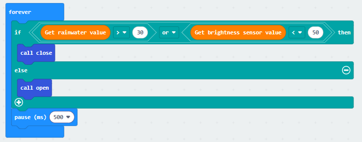

(7) With this, the main logic of the program is complete. Next, we need to fill in the control code inside the two functions. In the `open` function, to prevent the drying rack from extending before it has fully retracted, add a condition that checks if the `angle` is 0 before allowing extension.

(8) Add a servo control loop that increases the angle by 9 in each of 20 iterations, until the value reaches 180, thus fully extending the drying rack.

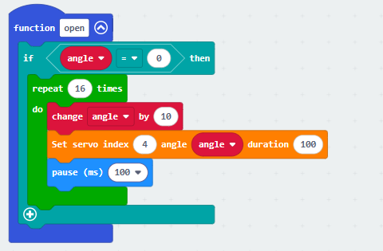

(9) Similarly, in the `close` function, add the corresponding code blocks and values to reverse the servo's motion, retracting the drying rack.

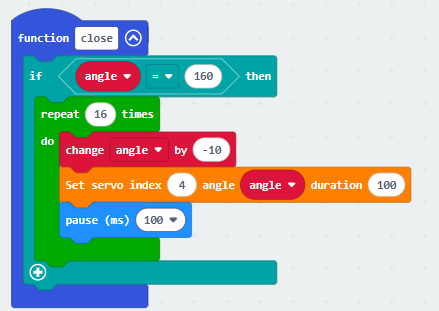

## 6.4 Temperature Control System

### 6.4.1 Project Introduction

This project uses a temperature and humidity sensor together with a fan module to create an intelligent environmental control system. The fan is automatically turned on or off based on the temperature and humidity readings.

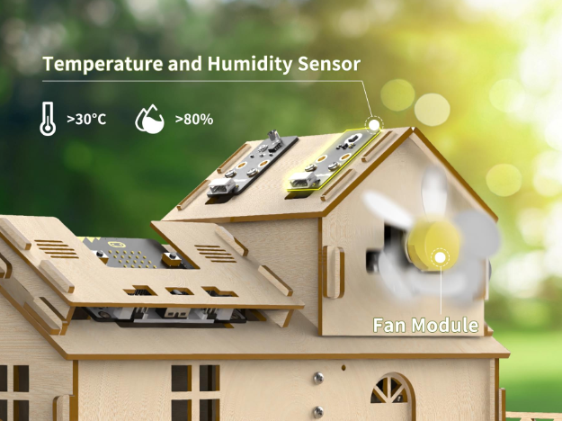

When the system detects that the temperature exceeds a predefined threshold, the fan is activated to lower the ambient temperature below that threshold. Likewise, when the humidity level exceeds the set value, the fan turns on to reduce the humidity. This enables automatic regulation of both temperature and humidity in the environment.

### 6.4.2 Project Process

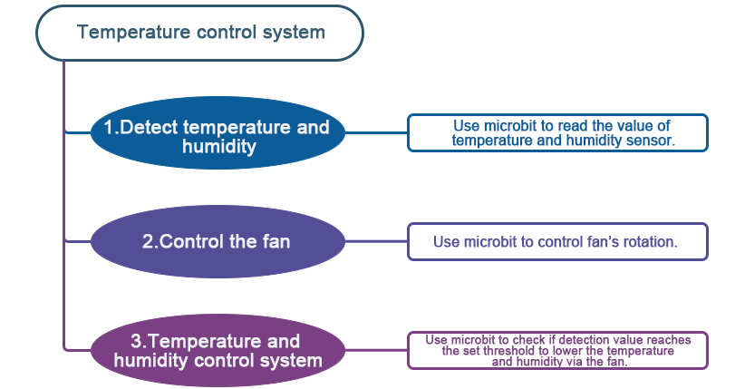

### 6.4.3 Module Instruction

*   **Temperature and Humidity Sensor**

This sensor is used to detect ambient temperature and humidity and accurately provides real-time data.

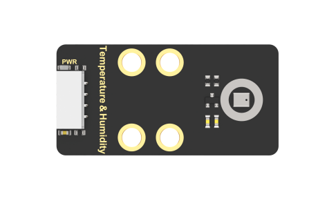

The temperature and humidity module (AHT10) converts the temperature and humidity in the air into digital signals, which are transmitted to the micro:bit controller via the I2C communication protocol.

*   **Fan Module**

This is a fan module that does not require an additional motor driver board, and its speed is adjustable. The fan is controlled via the I2C communication protocol. Additionally, the module features LEGO-compatible mounting holes, allowing for more creative DIY designs.

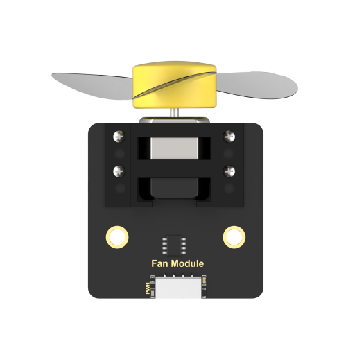

**For a detailed introduction to this sensor, please refer to the folder: [3.Specification & Diagram->2.Sensor Parameters]().**

### 6.4.4 Program Download
[Source Code]()

(1) Drag the program file from the corresponding folder into the MakeCode webpage.

(2) Click icon  on the left bottom of the interface, then click **"Connect Device"**, and follow the on-screen instructions to connect the micro:bit controller.

(3) Once connected, click the **"Download"** button in the bottom-left corner to flash the program to your micro:bit.

(4) After the download is complete, the indicator light will stop flashing rapidly and remain steadily lit. At the same time, a download completion message will appear on the programming interface.

### 6.4.5 Project Outcome

When the air temperature exceeds 30°C or the humidity level goes above 80%, the fan will start spinning. It will continue to operate until the temperature drops to 30°C or below and the humidity level falls to 80% or below, at which point the fan will stop.

### 6.4.6 Program Brief Analysis
[Source Code]()

(1) At startup, the program initializes the `I2C` expansion module, the temperature and humidity sensor, and the fan module.

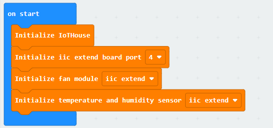

(2) Within an infinite loop, two conditional checks are set: whether the air temperature is greater than 30°C or the humidity is greater than 80%. These two conditions are connected using an `OR` logic.

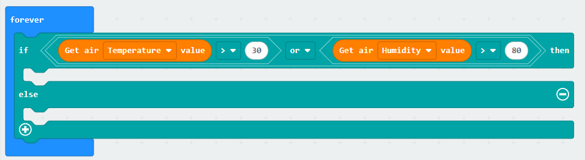

(3) If either condition is met, a control block is triggered to start the fan at a speed of 60. If neither condition is met, the fan is stopped.

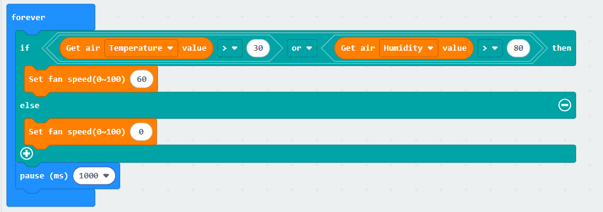

## 6.5 Soil Humidity Detection System

### 6.5.1 Project Introduction

This project uses a soil moisture sensor to monitor the moisture level of the soil. The detected moisture is displayed on the micro:bit's LED matrix as a level from 0 to 9. When the moisture level drops below level 3, the micro:bit controller will emit an alert sound.

### 6.5.2 Project Process

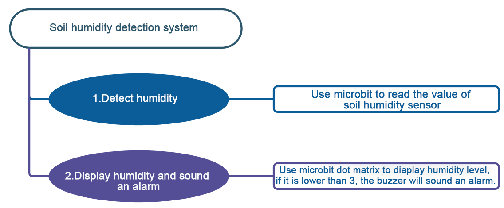

### 6.5.3 Module Instruction

This is a sensor designed to detect soil moisture. It converts the detected soil moisture into an analog signal output. Using this sensor in combination with a water pump module and tubing, you can create an automatic plant-watering system that waters your plants when the soil is too dry. Additionally, the surface of the sensor is treated with a gold-plating process, which improves its resistance to corrosion in soil and extends its lifespan.

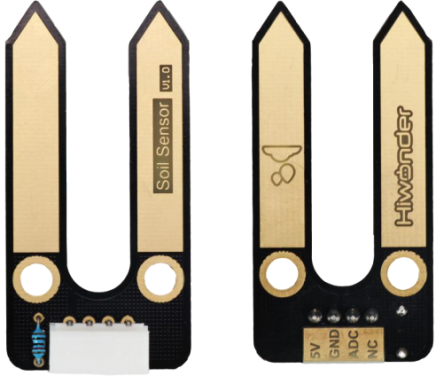

**For a detailed introduction to this sensor, please refer to the folder: [3.Specification & Diagram->2.Sensor Parameters]().**

### 6.5.4 Program Download
[Source Code]()

(1) Drag the program file from the corresponding folder into the MakeCode webpage.

(2) Click icon  on the left bottom of the interface, then click **"Connect Device"**, and follow the on-screen instructions to connect the micro:bit controller.

(3) Once connected, click the **"Download"** button in the bottom-left corner to flash the program to your micro:bit.

(4) After the download is complete, the indicator light will stop flashing rapidly and remain steadily lit. At the same time, a download completion message will appear on the programming interface.

### 6.5.5 Project Outcome

The micro:bit LED matrix displays the soil moisture level. **When the level is less than 3, the buzzer sounds an alert. When the level is greater than 3, the buzzer stops.**

### 6.5.6 Program Brief Analysis
[Source Code]()

(1) At startup, the soil moisture sensor is initialized.

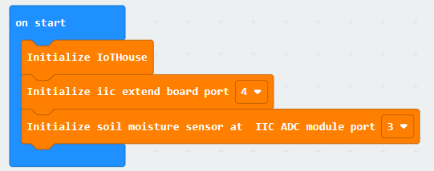

(2) Within an infinite loop, a variable named `humidity` is created to store the soil moisture value, which is then mapped from a range of 0–255 to a scale of 0–9.

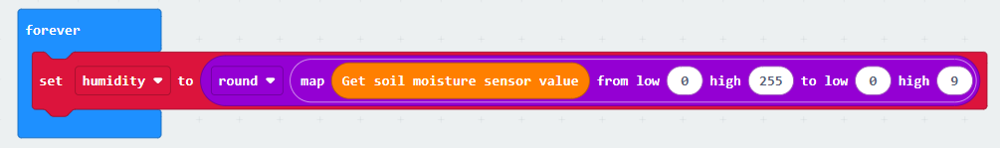

(3) A conditional statement is added: if the moisture level is below 3, the buzzer will sound an alert. Otherwise, the sound stops.

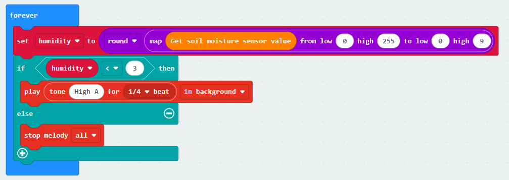

(4) Finally, the soil moisture level is displayed on the micro:bit LED matrix.

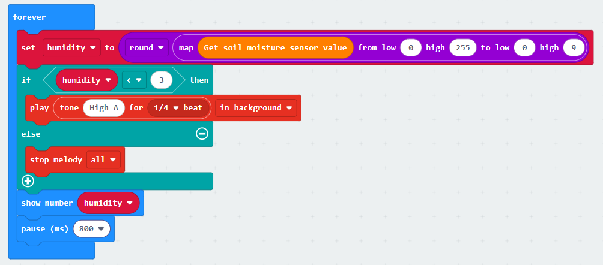

## 6.6 Automatic Irrigation System

:::{Note}
Caution: Fill the water tank only halfway to avoid overflow. Do not splash water onto other sensors, as it may cause short circuits, malfunction, overheating, or even explosion. Please be extremely careful!!! Please exercise extreme caution, especially for younger users—always operate under adult supervision. To ensure safety, please follow the instructions and safety regulations!
:::

### 6.6.1 Project Introduction

This project builds an automatic irrigation system using a water pump and a soil sensor. When the sensor detects that the soil is dry, the pump automatically activates to irrigate the soil. Once the soil becomes sufficiently moist, the system automatically stops the irrigation.

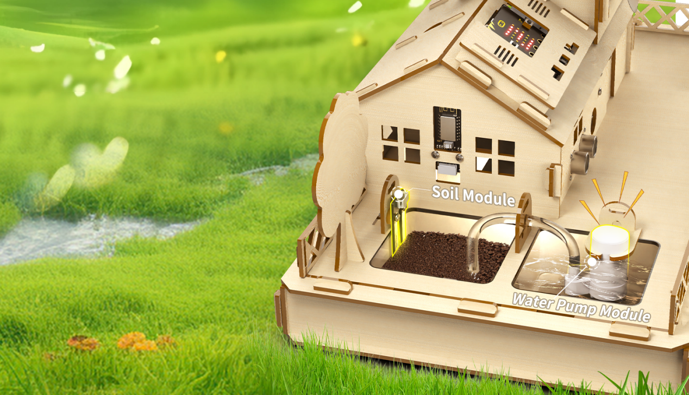

### 6.6.2 Project Process

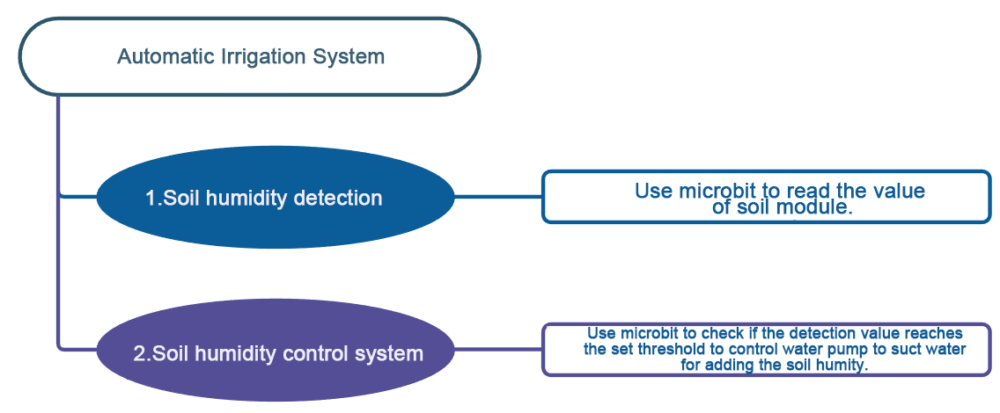

### 6.6.3 Module Instruction

*   **Soil Sensor**

This is a sensor designed to detect soil moisture. It converts the detected soil moisture into an analog signal output. Using this sensor in combination with a water pump module and tubing, you can create an automatic plant-watering system that waters your plants when the soil is too dry. Additionally, the surface of the sensor is treated with a gold-plating process, which improves its resistance to corrosion in soil and extends its lifespan.

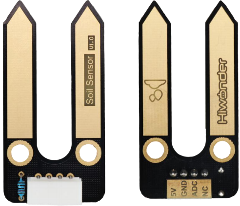

*   **Water Pump Module**

This is a common vertical mini micro water pump. To use it, simply place the pump into water and supply it with a 2.5V–6V DC power source. Once powered, the pump will begin operating.

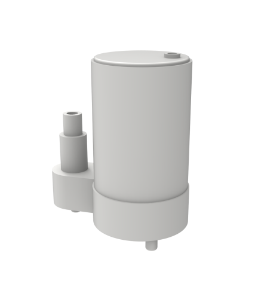

Inside the pump is a DC motor that drives the pumping mechanism to draw water through the pump chamber. Since the pump operates on DC voltage, you can connect either of the power wires to the positive or negative terminal, and it will still function correctly.

### 6.6.4 Program Download
[Source Code]()

(1) Drag the program file from the corresponding folder into the MakeCode webpage.

(2) Click icon  on the left bottom of the interface, then click **"Connect Device"**, and follow the on-screen instructions to connect the micro:bit controller.

(3) Once connected, click the **"Download"** button in the bottom-left corner to flash the program to your micro:bit.

(4) After the download is complete, the indicator light will stop flashing rapidly and remain steadily lit. At the same time, a download completion message will appear on the programming interface.

### 6.6.5 Project Outcome

The soil moisture level is divided into 10 levels (0 to 9). First, the micro:bit board displays the soil moisture level detected by the sensor. When the level is less than 3, the water pump turns on. When the level is greater than or equal to 3, the water pump turns off.

### 6.6.6 Program Brief Analysis
[Source Code]()

(1) At startup, the water pump module and the soil moisture sensor are initialized.

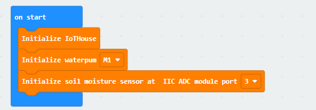

(2) In an infinite loop, a variable named `humidity` is created to store the moisture value. The raw sensor value (0–255) is mapped to a range of 0–9 to represent the moisture level.

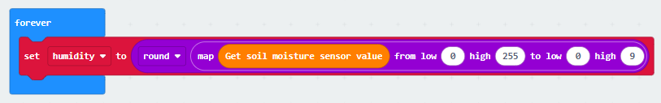

(3) A conditional statement checks the level: if the soil moisture level is below 3, the water pump is turned on. Otherwise, it is turned off.

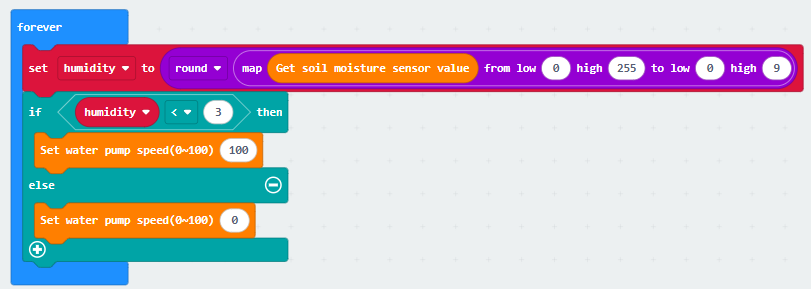

(4) Finally, the current soil moisture level is displayed on the micro:bit's LED matrix.

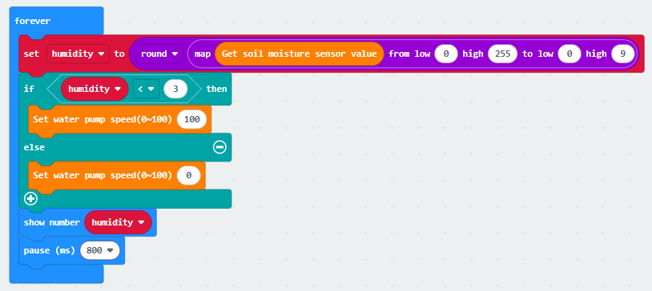

## 6.7 Night Alarm System

### 6.7.1 Project Introduction

This project uses an ultrasonic module and a light sensor to create a night alarm system controlled by the micro:bit. When it gets dark, and the ultrasonic module detects a person, the micro:bit's onboard buzzer will sound an alarm.

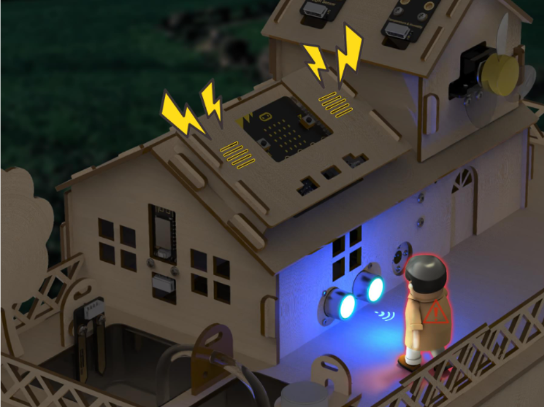

### 6.7.2 Project Process

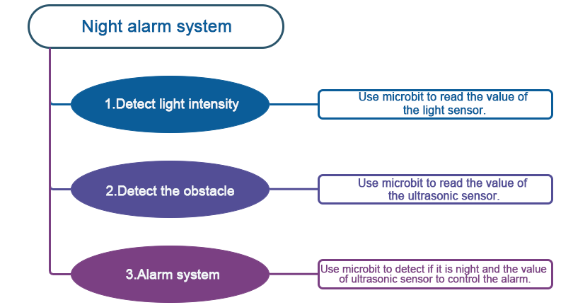

### 6.7.3 Module Instruction

*   **Light Sensor**

The light sensor is used to detect the intensity of ambient light. It converts light signals into electrical signals and is commonly used in interactive projects that react to changes in light intensity—such as automatic street lighting systems and environmental monitoring systems.

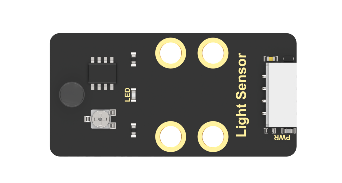

When light shines on the photoresistor, the stronger the light, the lower the resistance. As a result, the voltage across the resistor increases, causing the LED on the sensor to light up. Conversely, when the light is weak, the resistance increases, the voltage drops, and the LED turns off.

*   **Ultrasonic Module**

This module uses an `IIC` communication interface and can read distance measurements from the ultrasonic sensor via `IIC`.

Additionally, the ultrasonic probe integrates two RGB LEDs, which not only support brightness adjustment but also can produce colorful lighting effects through changes and combinations of the red (R), green (G), and blue (B) channels.

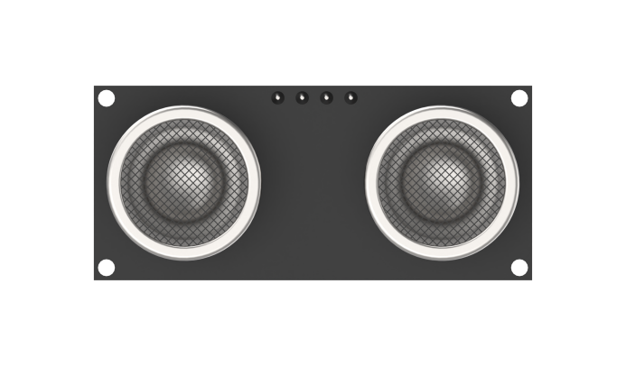

During distance measurement, the module automatically sends out 8 pulses of 40 kHz square waves and waits for a signal to return. If a signal is returned, the module outputs a high-level signal, and the duration of the high-level signal corresponds to the time it takes for the ultrasound to travel to the object and back.

The formula used to calculate distance is: Distance = (High-level time × Speed of sound (340 m/s)) / 2

### 6.7.4 Program Download
[Source Code]()

(1) Drag the program file from the corresponding folder into the MakeCode webpage.

(2) Click icon  on the left bottom of the interface, then click **"Connect Device"**, and follow the on-screen instructions to connect the micro:bit controller.

(3) Once connected, click the **"Download"** button in the bottom-left corner to flash the program to your micro:bit.

(4) After the download is complete, the indicator light will stop flashing rapidly and remain steadily lit. At the same time, a download completion message will appear on the programming interface.

### 6.7.5 Project Outcome

When the light sensor detects an intensity below 30 simulating nighttime and there is an object within 80 cm in front of the ultrasonic module, the micro:bit's buzzer will sound an alarm.

### 6.7.6 Program Brief Analysis
[Source Code]()

(1) At startup, the program initializes the `IIC` expansion module and the light sensor.

(2) Within a continuous loop, it checks the following condition:
If the ultrasonic distance is less than 80 mm and the light intensity is below 30.

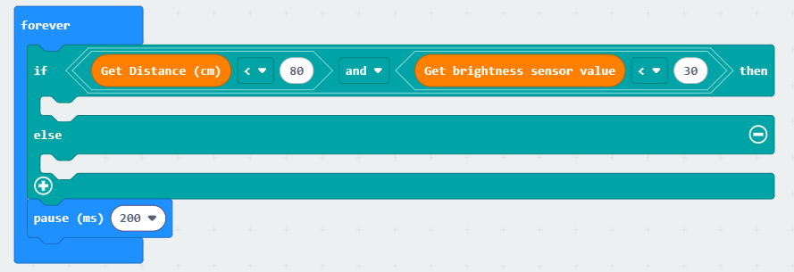

(3) Create a variable named `alert`. When the above condition is met, set its value to 1, and use the `play` code block to make the micro:bit buzzer sound an alarm.

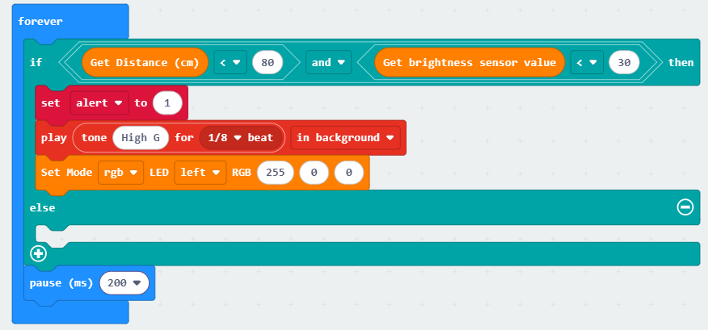

(4) Otherwise, set `alert` to 0 to stop the micro:bit buzzer from sounding.

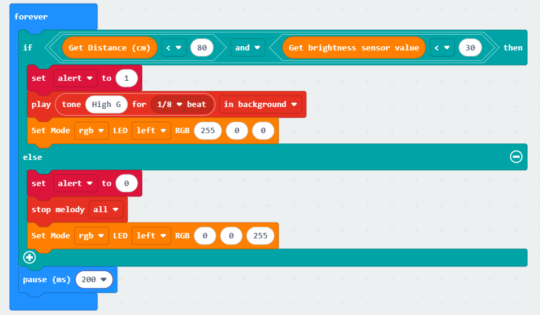

(5) Finally, create an infinite loop function that displays a pattern on the micro:bit LED matrix based on the value of the `alert` variable.

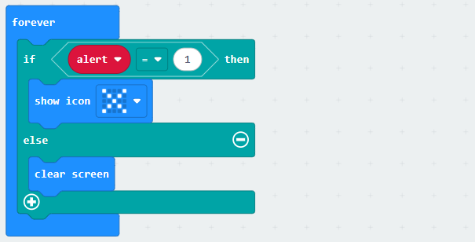

## 6.8 Automatic Door Control System

### 6.8.1 Project Introduction

This project builds an automatic door system using a servo motor, controlled by the A and B buttons on the micro:bit. Pressing button A opens the door, while pressing button B closes it.

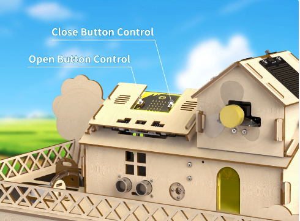

### 6.8.2 Project Process

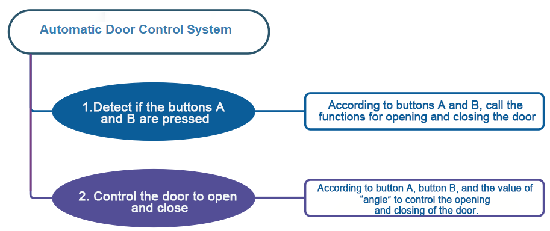

### 6.8.3 Module Instruction

LFD-01 is a PWM digital servo. To operate it, send a PWM signal with a 20ms cycle to the signal terminal, then adjust the pulse width to control the servo angle. The adjustable pulse width is from 500 to 2500μs, which corresponds to the angle of 0° to 180°.

### 6.8.4 Program Download
[Source Code]()

(1) Drag the program file from the corresponding folder into the MakeCode webpage.

(2) Click icon  on the left bottom of the interface, then click **"Connect Device"**, and follow the on-screen instructions to connect the micro:bit controller.

(3) Once connected, click the **"Download"** button in the bottom-left corner to flash the program to your micro:bit.

(4) After the download is complete, the indicator light will stop flashing rapidly and remain steadily lit. At the same time, a download completion message will appear on the programming interface.

### 6.8.5 Project Outcome

Press the micro:bit onboard button A to open the door, press button B to close the door.

### 6.8.6 Program Brief Analysis
[Source Code]()

(1) Initialize `IoTHouse`, the variable `angle`, and the initial position of the servo.

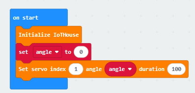

Use the variable `angle` to represent the servo rotation angle, initially set to 0. At startup, set the servo angle to `angle` (0°), meaning the door is closed.

(2) Create two functions: `openDoor` and `closeDoor`.

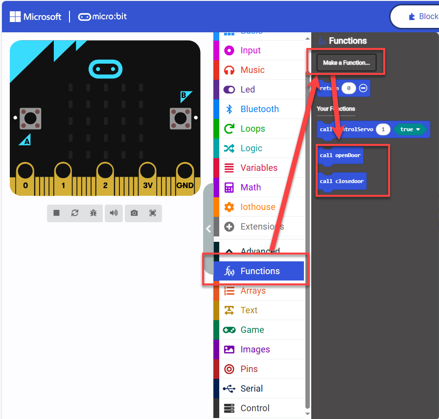

The `openDoor` function controls opening the door, while the `closeDoor` function controls closing the door.

(3) In the `openDoor` function, check whether the variable `angle` is equal to 0.

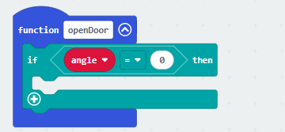

(4) If it equals 0, control the servo to rotate with an increment of 10 degrees, repeating 16 times—meaning the servo rotates to 160° and then stops. At this point, the door is open.

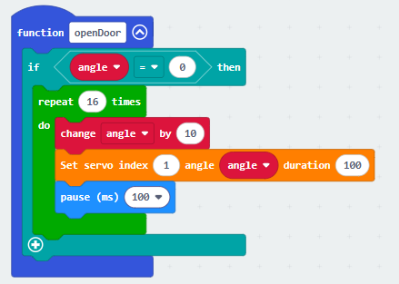

(5) In the `closeDoor` function, check whether the variable `angle` is equal to 160.

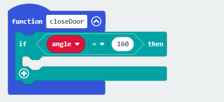

(6) If it equals 160, control the servo to rotate with an increment of -10 degrees, repeating 16 times—meaning the servo rotates to 0° and then stops. At this point, the door is closed.

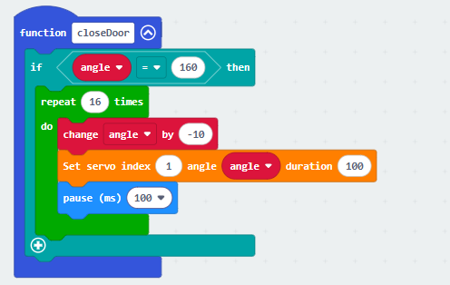

(7) When button A is pressed, call the `openDoor` function to open the door. When button B is pressed, call the `closeDoor` function to close the door.

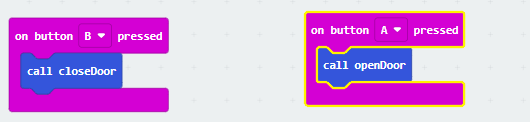

## 6.9 Sound Alarm System

### 6.9.1 Project Introduction

This project builds a sound alarm system using a light sensor and the built-in sound sensor on the micro:bit controller.

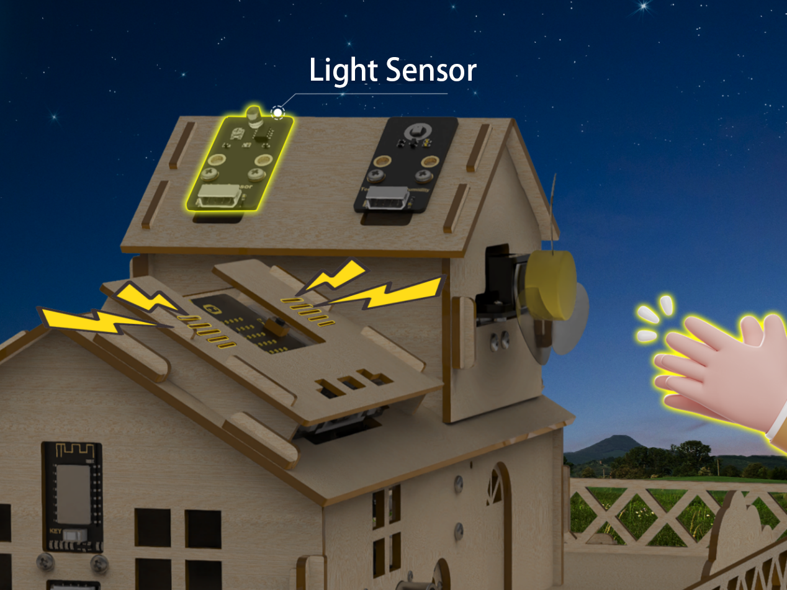

If sound is detected during the night, the built-in buzzer on the micro:bit will emit an alarm sound.

### 6.9.2 Project Process

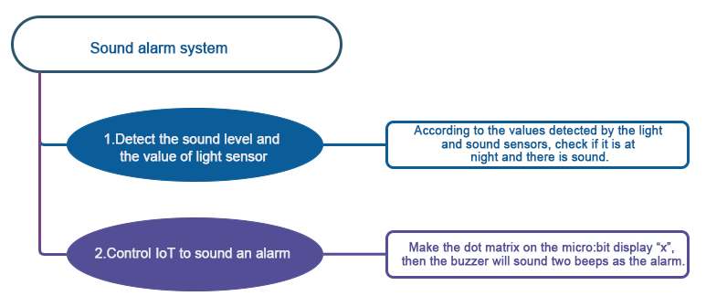

### 6.9.3 Module Instruction

*   **Light Sensor**

The light sensor is used to detect the intensity of ambient light. It converts light signals into electrical signals and is commonly used in interactive projects that react to changes in light intensity—such as automatic street lighting systems and environmental monitoring systems.

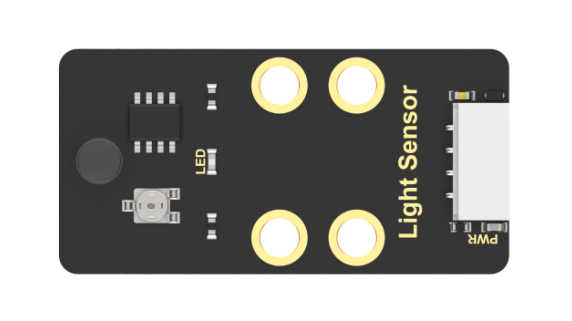

When light shines on the photoresistor, the stronger the light, the lower the resistance. As a result, the voltage across the resistor increases, causing the LED on the sensor to light up. Conversely, when the light is weak, the resistance increases, the voltage drops, and the LED turns off.

*   **Sound sensor**

The micro:bit V2.0 board is equipped with a sound sensor, see image below, which provides audio input to the micro:bit. It can detect ambient sound levels and convert them into digital values. When the microphone is activated, a red LED light will turn on at the front of the board.

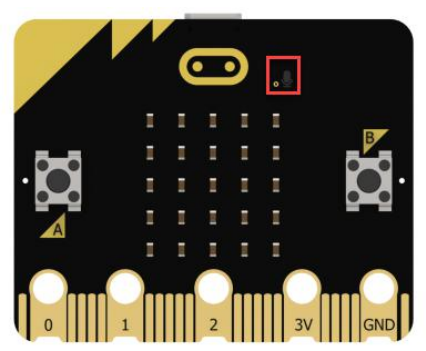

### 6.9.4 Program Download
[Source Code]()

(1) Drag the program file from the corresponding folder into the MakeCode webpage.

(2) Click icon  on the left bottom of the interface, then click **"Connect Device"**, and follow the on-screen instructions to connect the micro:bit controller.

(3) Once connected, click the **"Download"** button in the bottom-left corner to flash the program to your micro:bit.

(4) After the download is complete, the indicator light will stop flashing rapidly and remain steadily lit. At the same time, a download completion message will appear on the programming interface.

### 6.9.5 Project Outcome

When the light intensity is less than 30 and the detected sound level is greater than 100, an **"×"** will be displayed on the micro:bit LED matrix, and the buzzer will sound an alarm.

### 6.9.6 Program Brief Analysis
[Source Code]()

(1) Initialize the `IoTHouse` and the `ADC` module on port 2.

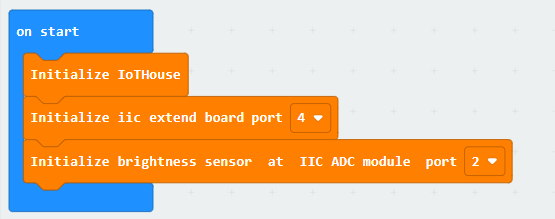

(2) Evaluate the sound level and the value from the light sensor.

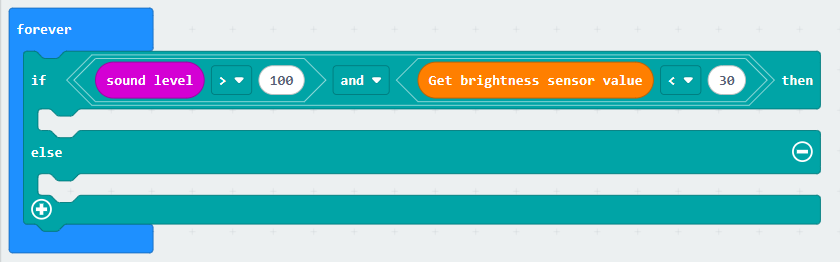

(3) If the sound level is greater than 100 and the light sensor value is less than 30, it indicates a nighttime environment with detected sound. In this case, the micro:bit LED matrix displays an **"×"**, and the buzzer triggers an alarm.

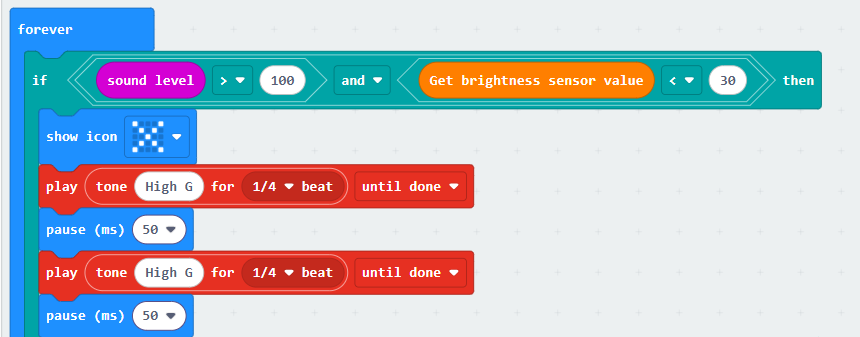

(4) If the above conditions are not met, the LED matrix is cleared, and the buzzer stops sounding.

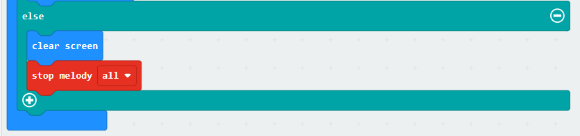

## 6.10 APP Control

:::{Note}
Prior to learning this lesson, it is recommended that you complete the previous 9 lessons and gain a fundamental understanding of sensor control. This will enable you to better comprehend this section.
:::

### 6.10.1 Project Introduction

In this project, let’s use the app to obtain data collected by various sensors and display it on the app interface. Additionally, the sensors such as the clothes airing rack, RGB module, water pump, and fan can be controlled through the app.

### 6.10.2 Project Process

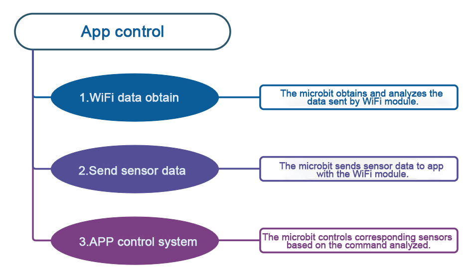

### 6.10.3 Program Download
[Source Code]()

(1) Drag the program file from the corresponding folder into the MakeCode webpage.

(2) Click icon  on the left bottom of the interface, then click **"Connect Device"**, and follow the on-screen instructions to connect the micro:bit controller.

(3) Once connected, click the **"Download"** button in the bottom-left corner to flash the program to your micro:bit.

(4) After the download is complete, the indicator light will stop flashing rapidly and remain steadily lit. At the same time, a download completion message will appear on the programming interface.

### 6.10.4 APP Installation and Connection

Locate the installation package named **"IoTHouse-V1.0.4.apk"** in this folder and install it on your mobile phone.

Follow the steps below to connect your device:

(1) Enable WiFi and location services on your phone.

(2) Open the `IoTHouse` APP.

(3) Tap the WiFi icon in the upper right corner of the APP. In the pop-up WiFi search interface, select `IoTHouse`, enter the password `12345678`, and connect.

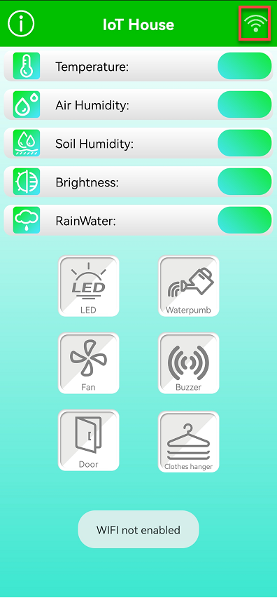 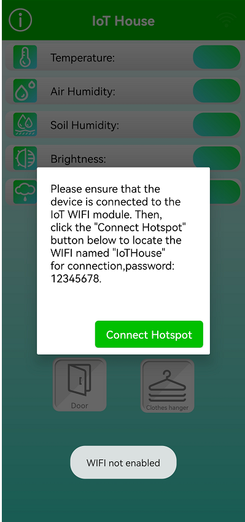 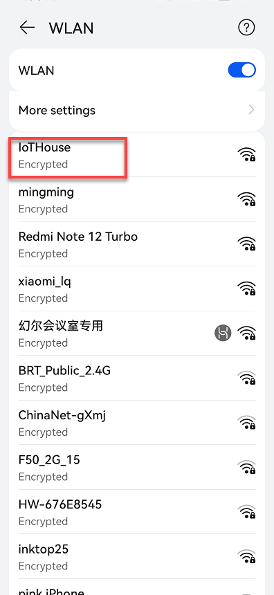

(4) If a prompt appears saying no internet access, select **"Keep connection."** Return to the APP. At this point, the WiFi icon will remain lit, and the APP interface will display the sensor data.

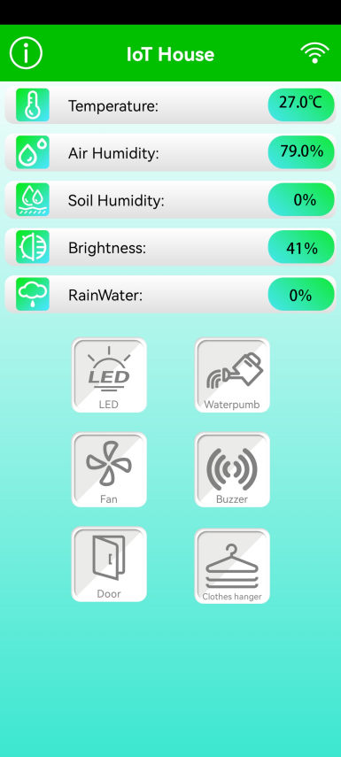

### 6.10.5 Project Outcome

The mobile APP interface is divided into two main sections: ① Data Display Area ② Control Area.

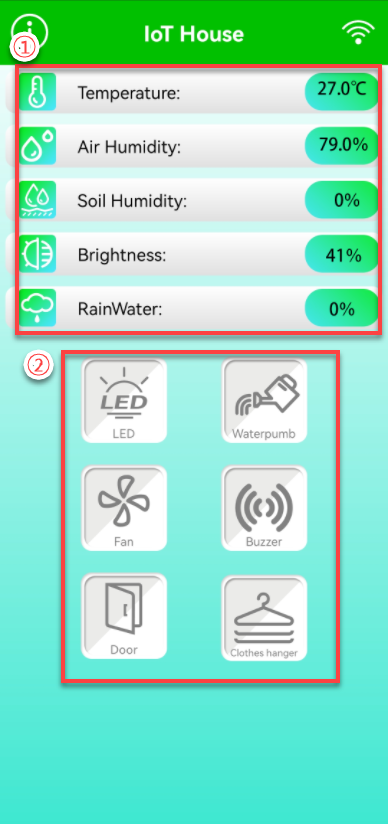

*   **Data Display Area – Icon Descriptions**

| **Icon** | **Function** |
|:---:|:---:|
|  | Displays the ambient temperature detected by the temperature & humidity sensor (°C). |
|  | Displays the ambient humidity detected by the temperature & humidity sensor (%). |
|  | Displays the soil moisture level detected by the soil sensor (%). |
|  | Displays the light intensity detected by the light sensor (%). |
|  | Displays the rainfall level detected by the raindrop sensor (%). |

*   **Control Area – Button Descriptions**

| **Icon** | **Function** |
|:---:|:---:|
| 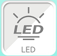 | Tap to turn the LED on or off. |
|  | Tap to turn the water pump on or off. |
|  | Tap to turn the fan on or off. |
|  | Tap to activate or deactivate the buzzer. |
| 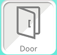 | Tap to open or close the door. |
|  | Tap to extend or retract the clothes rack. |

For a demonstration of how the mobile APP interacts with the system, please refer to the instructional video provided in the same directory of this section.

### 6.10.6 Program Brief Analysis
[Source Code]()

(1) Upon startup, set the WiFi module to direct connection mode, initialize the `I2C` expansion module, and the interfaces of the sensors.

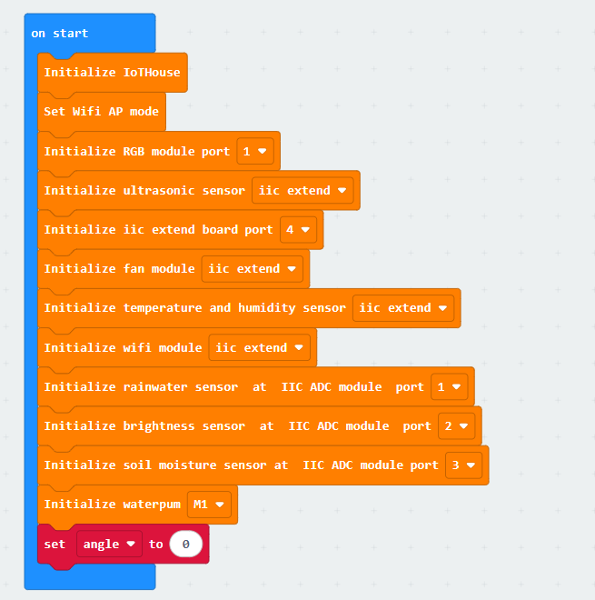

(2) Create an `angle` variable to control the angles of the door control servo and the servo for the clothes airing rack.

(3) Create the following variables:

① `Cmd`: Store the command type in the data packet instructions sent by the app.

② `Cnt`: Store the times the sensor data is obtained.

③ `prevCmd`: Used to confirm the command type above.

④ `prevValue`: Used to confirm the data above.

⑤ `recvData`: Store the data obtained from the WiFi module.

⑥ `value`: Store the data in the data packet instructions sent by the app.

(4) Create a function `controlServo` with two parameters under the **"Functions"**. The first parameter is a numeric type named **"id"**, and the second parameter is a boolean type named **"flag"**. This function is used to control the door servo and the clothes airing rack servo.

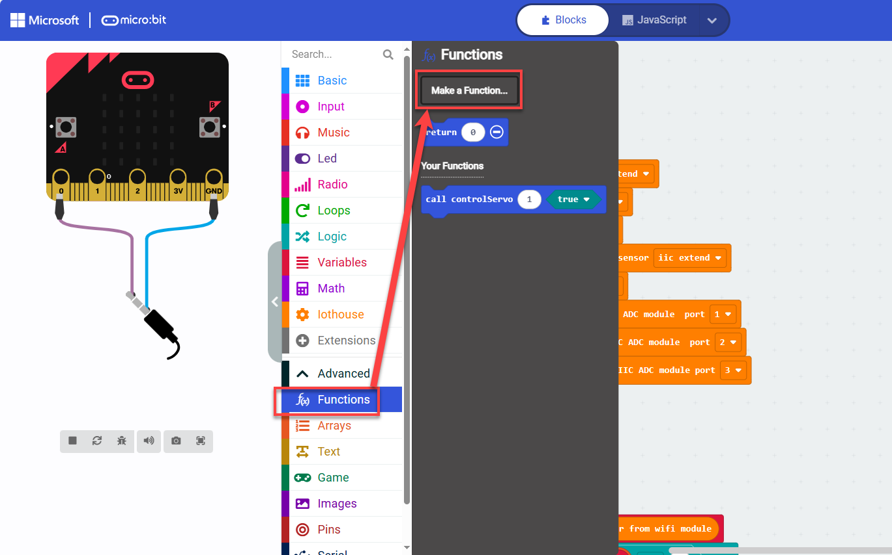

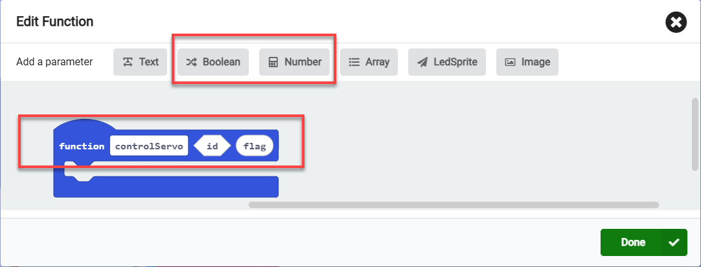

(5) In the `controlServo` function, create a condition to control the servo’s clockwise and counterclockwise rotation based on the `flag` value passed in. This can achieve the opening and closing of the door and the extension and retraction of the clothes airing rack.

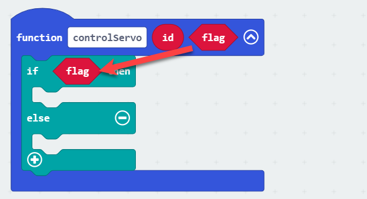

(6) Finally, create an infinite loop function that displays a pattern on the micro:bit LED matrix based on the value of the `alert` variable.

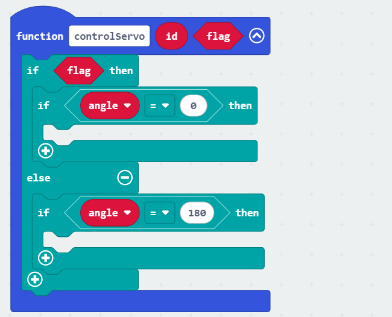

① When the `flag` is true, control the door to open or the clothes airing rack to extend. When the `flag` is false, control the door to close or retract the clothes airing rack. Both controls use a loop structure, repeating 16 times with an amplitude of ±10. 160° is fully open and 0° is fully closed. Simultaneously, when controlling the servo, confirm whether it is the door or the clothes drying rack is controlled through the `ID` number.

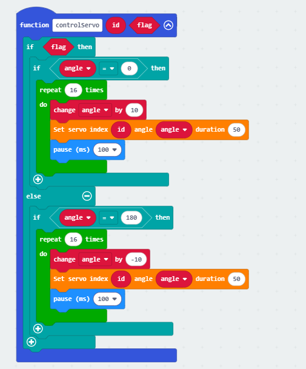

② In an infinite loop, receive data from the WiFi module and store it in the `recvData` variable. Determine whether the received data is valid by checking if the length of `recvData` is **"3"**. Then parse the command type and command parameter.

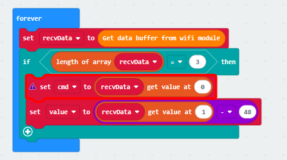

③ For each data acquisition, the `cnt` variable is incremented by 1. After acquiring data 7 times, the sensor data will be sent to the app via micro:bit and `cnt` will be reset to **"0"**.

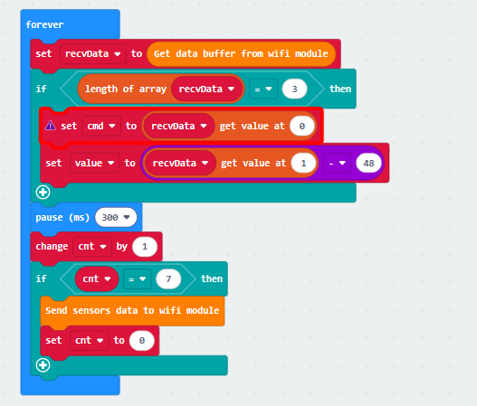

④ After parsing the command type and command data, confirm whether the data is a repeated reading or not based on the `revCmd` and `prevValue`.

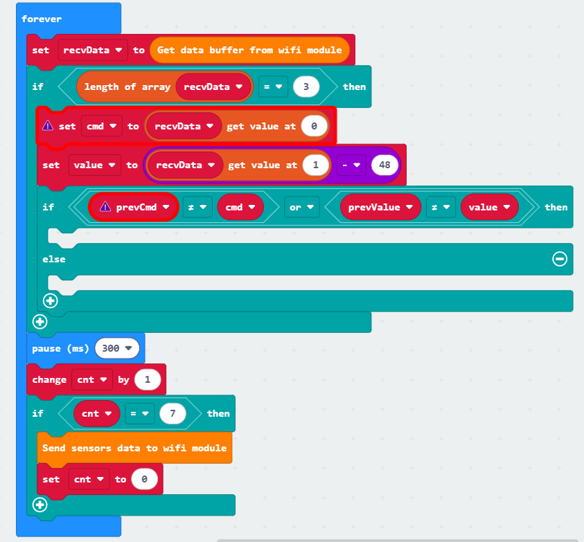

⑤ If there is no repeated reading, start to check the command type:

* 66: Control the on/off of the RGB LED.

* 67: Control the on/off of the water pump.

* 68: Control the on/off of the fan.

* 69: Control the buzzer to sound an alarm.

* 70: Control the open/close of the door.

* 71: Control the extension/retraction of the clothes airing rack.

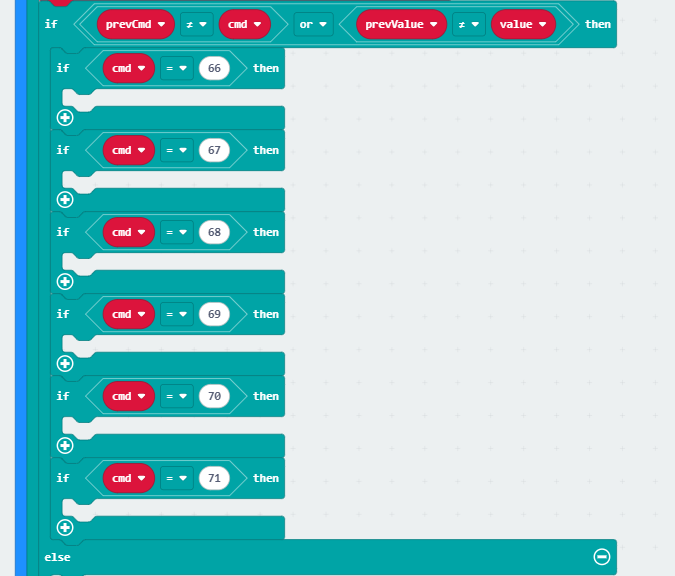

⑥ The on or off of the RGB LED is controlled based on the command parameter passed in. If the `value` is 1, all RGB LEDs are set to white, displaying colorful lights. Otherwise, the colorful lights are turned off.

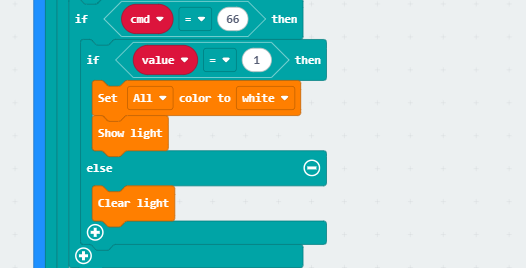

⑦ If the `value` is 1, the water pump speed is set to 100. Otherwise, the water pump speed is set to 0.

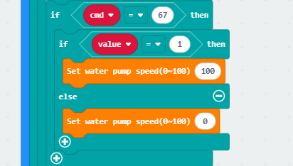

⑧ If the `value` is 1, the fan speed is set to 50. Otherwise, the fan speed is set to 0.

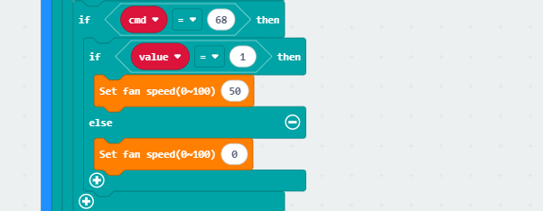

⑨ If the `value` is 1, the buzzer will sound an alarm. Otherwise, the alarm is stopped.

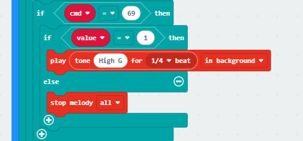

⑩ If the `value` is 1, the `controlServo` function is called with `id` set to 1 and `flag` set to true to open the door. Otherwise, `flag` is set to false to close the door.

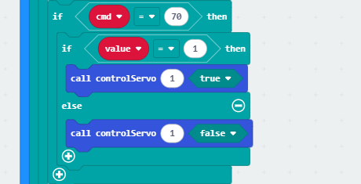

⑪ If the `value` is 1, the `controlServo` function is called with `id` set to 4 and `flag` set to true to extend the clothes airing rack. Otherwise, `flag` is set to false to retract it.

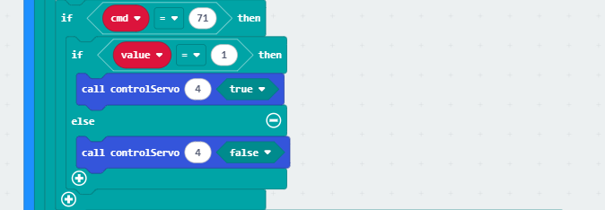